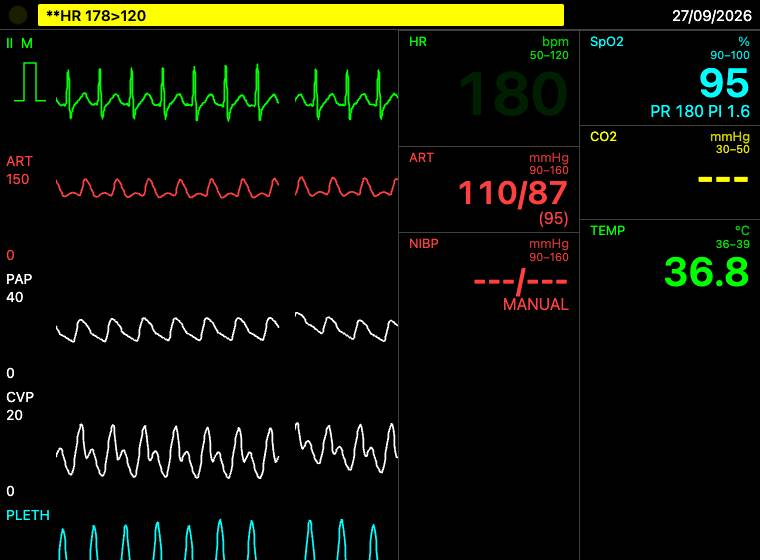
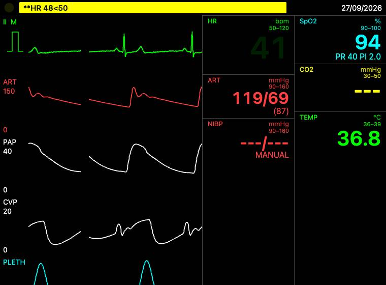
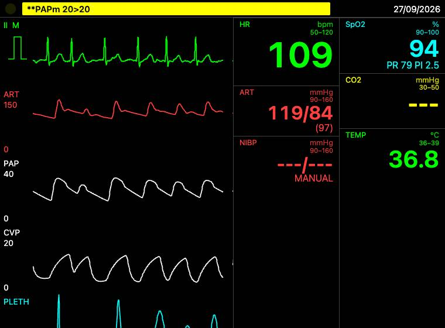

# Gate FU-2 — engine follow-ups

Branch `fu-2-engine-followups` (from `origin/main` `355b6d7` = 7a + 7b + 7g + 7x; `origin/main` merged before every
`engine.ts` edit and before the gate — only `docs/RESUME.md` moved meanwhile, 7c had not landed). Plan:
`docs/plans/fu-2-engine-followups.md` (12 tasks, every box ticked). One commit per task, pushed after each. Origins:
G7g NR-7g-5 / NR-7g-2, G7a NR-1, G-FU1 observations, "FU-2 additions (items 6–9)" and "FU-2 plan review
(2026-09-27 04:55)" in `research/00-orchestrator-rulings.md`. Every number below was measured on this branch (seed 7
unless stated); every one equals the plan's prototype number except the AF 100 "before" (76.0 here over 150–240 s,
the plan's 78.1 was a 130–220 s window).

## 1. What shipped

| # | Item | Mechanism | Files | Tests |
|---|---|---|---|---|
| 1 | MODELED rate ownership (NR-7g-5, HIGH) | `l2/circ/rate-rule.ts`: `SINUS_FAMILY` DERIVED from the rhythm library (`atria === 'sinus' && rateDrives === 'sinus'`, 11 rhythms; `avb3Narrow/Wide` excluded) follows the reflex's `hrModel` unless an instructor rate is held; `pacedAAI`/`pacedDDD` request `max(lower rate, hrModel)`; AF requests set rate × clamp(1 + 0.25·(hrModel/hrRest − 1), 0.9, 1.1); every other rhythm keeps its own rate. The held rate lives on the circulation (`CircModelState.hrSet`), written by `holdRate()` beside each `ps.hr =` write in `engine.ts`. | `l2/circ/rate-rule.ts` (new), `l2/circ/model.ts`, `l2/hemo/pipeline.ts` (MODELED `requestHr` branch), `engine.ts`, `vite.config.ts` (SLOW) | `test/l2/circ/rate-rule.test.ts` (7), `test/engine/circ-rate-rule.test.ts` (6, SLOW) |
| 1b | AF rate control + mapping re-fit | `AF_RATE_CAL` knots `[135, 131.2]`, `[145, 151.5]` (E-FU2-5). Esmolol / labetalol / metoprolol rows gain an `avNode` PD entry (E-FU2-6); the circulation reads `bus.avNodeBlock` (`ext.avNodeBlock`) and the MODELED AF request × (1 − block); the adenosine hook reads adenosine's OWN block from its row (E-FU2-7). | `l2/ecg/atria.ts`, `l2/pk/data/rows-cardiovascular.ts`, `l2/pk/hooks.ts`, `l2/circ/{model,rate-rule}.ts`, `engine.ts`, `vite.config.ts` | `test/l2/ecg/rhythm-atrial.test.ts` (+1), `test/l2/pk/av-node.test.ts` (2), `test/engine/af-rate-control.test.ts` (2, SLOW; amiodarone `it.fails`) |
| 2 | Dobutamine venous term (NR-7g-2) | `l2/circ/venous.ts`: dobutamine Ce/7 µg/kg/min → Hill volume shift out of `v0Sv`, Emax = the 12 mL/kg recruitable reservoir, competitive β shift with drug + chronic β occupancy; in `control()` the reflex's `dV0` and the β term share the reservoir (`recruit = max(−12 mL/kg·W, b.dV0 − dv0Beta)`, F4). | `l2/circ/venous.ts` (new), `l2/circ/model.ts`, `engine.ts` | `test/l2/circ/venous.test.ts` (5); `pk-acceptance-pd` dobutamine `it.fails` title/comment |
| 3 | Post-PVC compliance evidence (G7a NR-1) | No C(P) change (D5): the existing Stage 2 `C0·e^(−0.01(P − 95))` is pinned; the `it.fails` carries the prototype's four-way Langewouters/Modelflow evidence. | tests only | `test/l2/circ/circuit.test.ts` (+1); `hemo-acceptance` 5c title/comment |
| 4 | Rhythm on the 1 Hz `state` event (G-FU1 item 6) | `effectiveRateBpm()` beside the rhythm table; `state.rhythm = { id, rateBpm }` (optional); `ControllerSession.rhythm` follows it, so the panel select follows a shock outcome. | `l2/ecg/rhythms.ts`, `types-hemo.ts`, `l2/hemo/pipeline.ts`, `controller/src/{protocol.ts,session/controller-session.ts}` | `test/engine/state-rhythm.test.ts` (3), `controller/test/panel/controls-follow-shock.dom.test.ts` (1) |
| 5 | saadat-like 8 s HR | `hrAveragingOf`: `method: 'moving-average-seconds'` → `{ kind: 'seconds', n: windowDefault ?? 8 }`; an explicit `averaging` wins. Skin JSON unchanged. | `l3/hr.ts` | `test/engine/hr-skin-averaging.test.ts` (2), `test/l3/hr-averaging.test.ts` (1 changed, +1) |
| 6 | MANUAL tracker ringing at low HR | **Not planned** — the ruled α_R 0.15 breaks two Stage 2 bands on this base (see §5 and the plan's "Item 6: deferred"). | — | — |
| 7 | MANUAL `contractility` (R-7D-5b) | In `trackCircBeat` a contractility ≠ 1 fixes both ventricles' Emax factor and pins the tracker's g (`gMin = gMax = c`), so R alone holds MAP; the MANUAL tracker key carries contractility. Contractility 1 = the old path exactly. `svr` stays derived (D9). | `l2/hemo/pipeline.ts` | `test/engine/circ-manual-contractility.test.ts` (2) |
| 8 | Volatile CBF per tables §5.1 (R-7D-3, F3) | `CnsSpec.cmro2PerMac` / `cbfDirect`; `combine` multiplies `cmro2Mult` by max(0.5, 1 − k·MAC) and `cbfVaso` by `volatileCbfDirect` (Matta's DIRECT points, no division by the CMRO2 share); the sevoflurane/isoflurane linear `cbfVaso` PD entries removed. Desflurane / N2O untouched. | `l2/pk/{row,combine}.ts`, `l2/pk/data/rows-anaesthetic.ts` | `test/l2/pk/volatile-cbf.test.ts` (3) |
| 9 | Clearance temperature once | `PkCtx.hepFnTemp` (true only when 7c's `blood.core.liver` AND 7d's `organs.liver` exist); then the low-extraction hepatic share takes `hepFn` alone; `clFactor` exported. | `l2/pk/pipeline.ts`, `engine.ts` (`pkCtx`) | `test/l2/pk/clearance-temp.test.ts` (3) |
| — | Gate evidence | Live MODELED 7a page: SVT 180, sinus brady 40, AF 100. | `apps/demo/e2e/fu2.e2e.ts` | 1 e2e |

**Exceptions used (all approved; E-FU2-7 acknowledged):**
- **E-FU2-1** `engine.ts` 498–499: `circ7g.ext.betaAgonistU = betaVenousUnits(ps.pk.bus.agents)` and
  `circ7g.ext.avNodeBlock = ps.pk.bus.avNodeBlock`, beside 7g's `ext.betaBlockAdd` line. Other `engine.ts` lines: the
  two imports (69–70), `holdRate` (154–157) and its eight calls (240, 505, 574, 580, 586, 648, 668, 673).
- **E-FU2-2** `types-hemo.ts`: the `RhythmId` import and `rhythm?` on the `state` event (line 53).
- **E-FU2-3** `controller/src/protocol.ts` 110: `rhythm?` on the wire `state` type.
- **E-FU2-4** `engine.ts` `pkCtx`: the `organs` cast gains `liver?: unknown`, and line 446 `hepFnTemp`.
- **E-FU2-5** `l2/ecg/atria.ts`: `AF_RATE_CAL` gains the 135 and 145 knots; its comment gains two lines.
- **E-FU2-6** `l2/pk/data/rows-cardiovascular.ts` 70 / 73 / 76: one appended `avNode` entry on esmolol (0.5 / 150
  µg/kg/min), labetalol (0.4 / 2× ref) and metoprolol (0.5 / 2× ref). Amiodarone's entry unchanged.
- **E-FU2-7** `l2/pk/hooks.ts`: three imports (5–7), `ADEN_AV` / `adenosineBlock` (21–24), the `block` line (29).

## 2. Numbers vs bands (re-measured on this branch)

| Item | Measure | Band / target | Before | After | Result |
|---|---|---|---|---|---|
| 1 | SVT (AVNRT) set 180, MODELED, monitor HR 80–120 s | 180 ± 5 | 139.9 | **179.9** | pass |
| 1 | sinus bradycardia set 40 (80–120 s → 150–240 s on phenylephrine 1 µg/kg/min) | 40 ± 3 | 59.1 → 59.1 | **40.2 → 40.1** | pass |
| 1 | VT 170 / atrial tachycardia 170 / junctional escape 50 / CHB wide 32 / VVI 70 | ± 3 | 120.0 / — / — / — / — (first failure stops the loop; plan: 150.0 / 60.0 / 40.0 / 74.5) | **169.8 / 170.0 / 50.0 / 32.0 / 70.0** | pass |
| 1 | AF set 100 (150–240 s); with phenylephrine | 100 ± 5; ×0.88–0.98 | 76.0; ×0.875 | **101.0; 95.6 (×0.947)** | pass |
| 1 | AF set 140 (monitor 80–120 → 150–240 s; state hr; true beat rate 150–240 s) | no band | plan: 78.3 | monitor 149.8 → 157.3; state hr 153.4 (AV drive at its +10 % bound: hypotensive at fast AF); beats 155.6 | record |
| 1 | AAI 70: phenylephrine / bleed 1225 mL over 60 s (150–240 s) | 70 ± 3 / ≥ 80 | 61.3 / 91.3 | **70.0 / 91.4** | pass |
| 1 | sinusPause, avb2to1, wpwSinus without / with an explicit rate (unit) | reflex / held | held | **reflex / held** | pass |
| 1 | sinus at rest + phenylephrine 1 µg/kg/min (HR change) | −5 to −15 | 70.0 → 61.5 | 70.0 → 61.5 (unchanged path) | pass |
| 1 | sinus brady 40 → `sinus` without a rate at 90 s | reflex owns it again (> 60) | 59.2 → 70.2 | 40.3 → 70.1 | pass |
| 1 | flutter 2:1 MODELED monitor | 150 | 150.0 | 150.0 | pass |
| 1 | adenosine 6 mg on AVNRT (7g scenario); circ-sanity 1 phenylephrine 100 µg (dMAP / dHR) | existing bands | pass | pass (dMAP 21.3, dHR −14.7) | pass |
| 1b | AF mapping, `runRhythm` 600 s, seed 21: 130 / 135 / 140 / 145 / 150 | ± 2 % | 131.0 / 137.9 (+2.1 %) / 141.4 / 146.1 / 151.1 | 131.0 / **137.0** / 141.4 / **146.3** / 151.1 | pass |
| 1b | … seeds 11–13 mean: 130 / 135 / 140 / 145 / 150 | — | 130.6 / 136.3 / 139.8 / 144.7 / 149.9 | 130.6 / 135.4 / 139.8 / 145.1 / 149.9 | record |
| 1b | MANUAL engine, 4 seeds (11–13, 21), true mean vs monitor HR at 130 / 135 / 140 / 145 | — | — | true 130.7 / 135.7 / 140.1 / 145.3; monitor 136.5 / 140.9 / 144.7 / 149.4 (+3–5 %: Q-FU2-11) | record |
| 1b | MODELED AF 130 + esmolol 0.5 mg/kg + 150 µg/kg/min (monitor, 1020–1320 s) | fall 20–30 % | 136.3 → 138.4 (−1.6 %) | **136.3 → 99.7 (26.9 %)** | pass |
| 1b | MODELED AF 130 + amiodarone 150 mg over 10 min (720–900 s) | fall 20–30 % | 136.3 → 148.2 (−8.8 %) | 136.3 → 117.2 (14.0 %) | **`it.fails`** (Q-FU2-9) |
| 1b | bus `avNodeBlock`: esmolol 150 µg/kg/min / metoprolol 5 mg / labetalol 20 mg / amiodarone 150 mg | — | 0 / 0 / 0 / 0.15 | 0.25 / 0.25 / 0.2 / 0.15 | pass |
| 1b | esmolol 300 + metoprolol 10 mg + amiodarone 300 mg (900 s): block; adenosine hook on sinus/AF/AVNRT | no rhythm change | block 0.198 | block ≥ 0.5; hook **null** for all three | pass |
| 2 | dobutamine 5 µg/kg/min, engine CO at 20 min (7g test) | +20–40 % | +3.9 | **+11.8** | **`it.fails`** (Q-FU2-3) |
| 2 | … β-blocked profile | ≤ half the free rise | +0.9 | +3.4 (≤ 5.9) | pass |
| 2 | … circ level, unventilated, reflexes on (CO 360–400 s) | ≥ +8 points vs without | +7.6 | +17.0 | pass |
| 2 | 25 % haemorrhage + β potency 1: largest mobilised unstressed volume (F4) | ≤ 840 mL (12 mL/kg) | reflex alone 669; unclamped 865 | **840** | pass |
| 2 | phenylephrine 0.1 / 0.25 / 0.5 / 1 · norepinephrine 0.05 / 0.1 / 0.2 µg/kg/min (MAP %) | 7g bands | pass | 13.7 / 23.4 / 29.8 / 34.2 · 20.2 / 30.2 / 40.4 | pass |
| 3 | post-PVC SBP, hemo-acceptance 5c (seed 5, n 5) | +8–15 mmHg | −10.9 | −10.9 (no change, D5) | **`it.fails`** (Q-FU2-4) |
| 3 | prototype only (not repeated, D5): Langewouters p0 40.4 / p1 39.4 whole range; below 95 only; below 80 / 70; p0 70 p1 20 | — | — | −9.9 (breaks 5 bands); −10.4 (foot 100.09 ms > 100); −11.2 / −11.0; −8.0 | evidence |
| 4 | VF → shock → asystole (zoll-like seed 4): `state.rhythm`, session, panel select | follows | stays `vfCoarse` | `{ id: 'asystole', rateBpm: 0 }`; select `asystole` | pass |
| 5 | saadat-like, 60 → 120 step, HR at +2 … +10 s | 8 s moving average | 60 67 75 86 100 120 120 120 120 (settled +7 s) | **64 71 78 85 92 99 106 113 120** (settled +10 s) | pass |
| 5 | philips-like, same step | unchanged | 60 67 75 86 100 120 120 120 120 | 60 67 75 86 100 120 120 120 120 | pass |
| 7 | MANUAL 110/70, CVP 6, HR 80: contractility 1 → 0.5 (CO / ABP (MAP) / SVR) | CO ≤ 0.8×, MAP ± 5, SVR > 1.2×, PP narrows | 6.82 / 112/71 (85) / 0.64 at both (ignored) | 6.82 / 112/71 (85) / 0.64 → **4.74 / 102/77 (87) / 0.96** | pass |
| 7 | MANUAL contractility 0.3, CVP 12, 85/55 (tables §7 check 20 premise) | MAP 60–72, CO ≤ 4 | CO 6.39, ABP 67/51 (59), SVR 0.39 | **CO 3.28, ABP 76/62 (68), SVR 0.96** | pass |
| 8 | direct CBF (bus `cbfVaso`), sevoflurane 0.5 / 1.5 MAC | 1.04 / 1.17 | 1.10 / 1.30 | **1.04 / 1.17** | pass |
| 8 | … isoflurane | 1.19 / 1.72 | 1.20 / 1.60 | **1.19 / 1.72** | pass |
| 8 | CMRO2 (bus `cmro2Mult`) at 1.5 MAC, sevoflurane / isoflurane; iso 2.5 MAC | 0.625 / 0.55; floor 0.5 | 0.70 / 0.70 | **0.625 / 0.55; 0.5** | pass |
| 9 | midazolam clearance factor at 33 °C with 7d's liver function 0.62 | applied once: 0.62 | 0.50 (0.62 × 0.81) | **0.62**; without 7d 0.81 (unchanged) | pass |

The whole engine suite is otherwise unchanged: engine-core 197 files / 854 tests pass (2 skipped), the Stage 2 / 7a /
7g bands included. No band was widened, removed or re-worded (R45); the two touched `it.fails` changed their title and
comment only.

## 3. Screenshots (`docs/gates/fu-2/`, JPEG ≤ 60 KB, live MODELED Stage 7a page at ×4, 60 sim-s after each rhythm)

The HR tile reads the set rate — not the reflex's — and the ART waveform follows the rhythm's beats.

- SVT (AVNRT) set 180: the state hr 180.0, `state.rhythm` `{ svtAvnrt, 180 }`; HR tile 180 (the HR > 120 alarm fires,
  as it should).  (40.7 KB)
- Sinus bradycardia set 40: state hr 40.0 — before FU-2 the reflex's 69 bpm was clamped to 59.
   (32.8 KB)
- AF set 100: state hr 104.6 (the reflex's AV drive, ≤ +10 %, on the hypotensive page; within the e2e's ± 10).
   (37.5 KB)

## 4. Decisions and deviations

Decisions (the plan's, not revisited):
- **D1** an explicit sinus rate (rhythm with `rateBpm`, `setTarget hr`, `pin hr`) is held like MANUAL; a sinus-family rhythm without a rate hands it back; engine-initiated sinus rates belong to the reflex.
- **D2** the held rate is `CircModelState.hrSet` (a copy of `ps.hr`); snapshots carry it; `setMode` keeps it.
- **D3** AF only is AV-modulated (share 0.25, ±10 %); flutter and pre-excited AF are not; AAI/DDD request max(lower rate, reflex).
- **D4** the β venous term is dobutamine only, Emax = the 12 mL/kg reservoir shared with the reflex (clamped sum).
- **D5** NR-1: no C(P) change; the evidence rides on the 5c `it.fails`.
- **D6** `state.rhythm` is optional; its rate is `effectiveRateBpm` (atrial rate for 2:1 / high-grade / Mobitz), rounded to 0.1.
- **D7** saadat's 8 s mapping lives in code (`hrAveragingOf`), not in the skin JSON.
- **D8** `circ-rate-rule` and `af-rate-control` join the SLOW list.
- **D9** MANUAL contractility ≠ 1 fixes Emax and removes the tracker's PP knob; `svr` stays derived.
- **D10** `cbfVaso` is the DIRECT factor (Matta); 7d's NET CBF = direct × its coupling.
- **D11** `hepFnTemp` only when 7c's `core.liver` and 7d's `organs.liver` both exist.
- **D12** AF mapping knots at 135 and 145; the monitor's AF over-read is a monitor item (Q-FU2-11).
- **D13** esmolol/metoprolol/labetalol AV-nodal entries; MODELED AF × (1 − block); adenosine hook reads its own block.

Deviations: none in code. Every code block was applied as written; every anchor matched byte for byte (7c had not
merged when this branch was gated, so no re-anchoring was needed). `grep -n "ps.hr = " engine.ts` lists exactly one
write without a `holdRate` call after it — the MODELED `requestHr` callback — so no sibling `ps.hr` write needed an
extra call. Process notes: (a) the full `test:e2e` regenerates other stages' evidence images; those were reverted,
not committed. (b) `fu2.e2e.ts` skips WebKit (the plan's conditional G7g rule): on the PR's first CI run
(36294420648) Chromium passed it (47.6 s) but headless WebKit wrote a JPEG over 60 KB (its font rendering) and then
closed the page on the retries; the plan's `test.skip(... 'webkit' ...)` line was added after `let base = '';`.

## 5. For the orchestrator / Ali

Open questions (from the plan; none blocks): Q-FU2-2 (should a later drug move a held sinus rate?), Q-FU2-3
(dobutamine +11.8 % vs +20–40 %: the reflexes return about half of the mobilised volume; circ level +17 %), Q-FU2-4
(NR-1: option (b) refuted by measurement; the lever left is filling through the compensatory pause), Q-FU2-6 (MANUAL
`svr` settable?), Q-FU2-7 (item 6), Q-FU2-8 (desflurane / N2O CBF: no table numbers), Q-FU2-CBF (net vs direct),
Q-FU2-9 (amiodarone rate control 14.0 %: Emax ≈ 0.5–0.6 needed, a 7g row value change), Q-FU2-10 (AAI/DDD above the
lower rate are drawn as paced beats), Q-FU2-11 (monitor HR over-reads AF by 3–5 % at 130–145).

Calibration items: the dobutamine gap; the NR-1 evidence; `AV_GAIN` 0.25 / `AV_MOD_MAX` 0.1 [ENG]; the AF
rate-control Emax values (esmolol 0.5 / EC50 150, metoprolol 0.5 / 2×, labetalol 0.4 / 2× [ENG]) and amiodarone's
14 %; the monitor's AF over-read; item 6's two options — diagnose on the 7d branch with check 19 as the red test, or
rule on hemo-acceptance 3 (90/50 ramp 4.19 mmHg off at α_R 0.15) and 8 (transducer ζ 1.2 DBP −0.78). Item 6 numbers
(prototype, 7d check 19 MANUAL, seed 3): α_R 0.5 today +24.3 with 99 ↔ 127 ringing (≈ 18 s cycle); 0.15 everywhere
+31.9, no ringing, 2 Stage 2 bands fail; scheduled 0.5 → 0.15 +20.6, still rings; 0.5 × (R₀/R)² +24.7 / +24.5.

What 7d's executor can flip: check 20's premise through MANUAL contractility (MAP 68, CVP 12, CO 3.28 reachable);
the `cbfVaso` deviation — 7d now multiplies the DIRECT factor by its coupling; the temperature double count
(`hepFnTemp` turns on by itself once `ps.organs.liver` exists).

## 6. Sibling requirements (F5)

- **7d:** `organsCtx.setHr` (the Cushing / organ HR write) must call `holdRate(ps, ps.rhythm.pendingSwitch?.id ??
  ps.rhythm.id, false)` right after its `ps.hr` write, like every other engine-initiated rate (Task 2 (d)–(g)).
- **7e:** the endocrine HR factor `hrAt × endoHrF` applies to the sinus family only (`SINUS_FAMILY.has(ps.rhythm.id)`
  from `l2/circ/rate-rule.ts`); every other rhythm keeps its own rate (NR-7g-5).

## 7. MANUAL-held rate, for console users (7x physiology console and the instructor panel)

A rate set with `setTarget hr` / `pin hr`, or a rhythm set WITH `rateBpm`, is HELD — in MANUAL as before, and after a
switch to MODELED too (`setMode` keeps the held rate, D2), so the reflexes and drugs do not move it. The reflex takes
a sinus-family rate back only when a sinus-family rhythm (sinus, sinus brady/tachy/arrhythmia/pause, WPW in sinus,
1st/2nd-degree and high-grade AV block) is set WITHOUT a rate. Rhythm-intrinsic rates (SVT, atrial tachycardia,
junctional, VT, AIVR, complete-block escape, VVI) always hold; AF's ventricular response moves by at most ±10 % with
the reflex and falls with rate-control drugs (esmolol, metoprolol, labetalol, amiodarone); an AAI/DDD pacer never falls
below its lower rate, but a reflex tachycardia can take the rate above it.

## 8. Test counts

| Package | Files | Tests |
|---|---|---|
| engine-core (`CI=1`, all) | 197 | 854 passed, 2 skipped |
| … fast set (`PME_TEST_SET=fast`, 36 s) | 179 | 769 passed, 1 skipped |
| … slow set (`PME_TEST_SET=slow`, 450 s on a shared machine) | 18 | 85 passed, 1 skipped |
| controller | 35 | 197 |
| renderer | 20 | 66 |
| skins | 16 | 168 |
| ventilator | 14 | 88 |
| audio | 10 | 58 |
| validation | 5 (+1 skipped) | 16 passed, 5 skipped |
| apps/demo | 7 | 114 |

New in FU-2: engine-core +10 files / +38 tests (rate-rule 7, circ-rate-rule 6, af-rate-control 2, av-node 2, venous 5,
circuit +1, rhythm-atrial +1, state-rhythm 3, hr-skin-averaging 2, hr-averaging +1 (and one re-titled), circ-manual-contractility 2,
volatile-cbf 3, clearance-temp 3); controller +1 file / +1 test.

`pnpm -r typecheck` clean; `pnpm build` clean; `check-notices: OK (3 governed files)`. e2e (`PW_SYSTEM_CHROME=1 pnpm
test:e2e`): **27 passed** (8.5 min), including `fu2.e2e.ts` (≈ 46 s; SVT 180.0, sinus brady 40.0, AF 104.6).

24 h long-run horizon (local, no `CI`; the five long-run files in parallel on a machine shared with three other
executors, so not idle): **5 files / 16 tests pass, 275 s wall** (engine-pipeline, hemo, resp, lung, pk long runs, 250–273 s
each).
