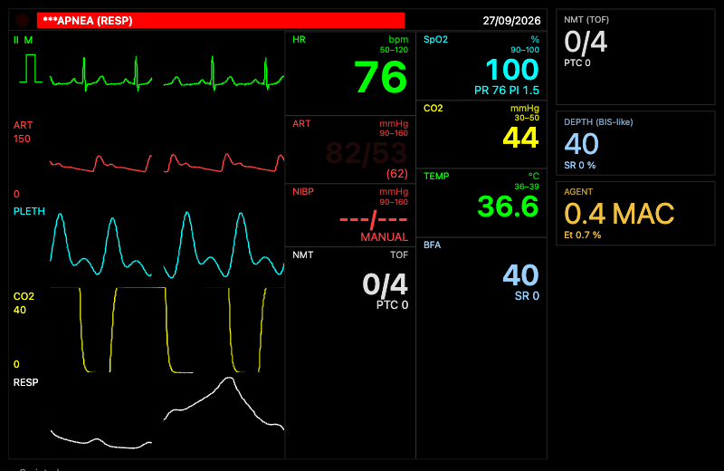
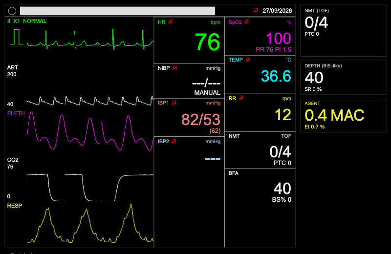

# Gate FU-3 — engine follow-ups (items 1–16)

Branch `fu-3-followups` from `origin/main` `7cbd42b` (7a + 7b + 7g + 7x + FU-1 + FU-2 + 7c + 8a + 7f + 7d, CI amendment
4). Plan: `docs/plans/fu-3-followups.md` (Tasks 0–15, executed in order; every find block matched exactly once). One
commit per task (Tasks 12 and 14 have the plan's extra commits), pushed after each. `origin/main` was merged before the
`engine.ts` edits of Task 5 (only `docs/RESUME.md` had moved) and re-checked before Tasks 6, 7, 11 and 15.
**Stage 7e (PR #22) merged to `main` while this branch waited at Task 15**; it was merged in (`39db895`: one conflict,
`engine.ts` `rhythmCtx` — 7e's `endoF` on `hrAt` and FU-3's `pacerLowerAt` both kept). Task 11's t16 fallback was then
removed (`a6bf4f0`, t16 runs on the real 7e) and the FU-3 numbers 7e moved were recorded under R45 (`dd887be`, §2
and Deviation (i)). The tables below give the pre-7e FU-3 value where 7e moved it.
Every number below was measured on this branch unless marked "plan".

## 1. What shipped

| Task | Item | Mechanism | Files | Tests |
|---|---|---|---|---|
| 0 | base check | none — the 7f rocuronium 0.6 engine rig is already ventilated on main (7d's E-7d-4, `rr: 18`); Step 1 PASSED (TOF 0 / TOFR 0.9 in band, 24.9 s wall), Steps 2–4 not needed, E-FU3-0 unused | — | — |
| 1 | 1 succinylcholine PK | Roy 2002 CL 0.037 L/kg/min, V1 0.038 L/kg [P]; ke0 0.1475/0.236 [ENG]; effect-site EC50 1160 ng/mL, γ 6 (7g's fit copy and 7f's mirrored row, E-FU3-1); `PCHE_CL_MULT.hom` 0.003 → 0.011 | `l2/pk/nmb.ts`, `l2/pk/data/rows-cardiovascular.ts`, `l2/neuro/nmb.ts` | `nmb-course.test.ts` pre-declared `it.fails` → `it` (E-FU3-2) |
| 2 | 2 sugammadex underdose | none: capacity-limited (16.1 µmol sugammadex vs 63.5 µmol rocuronium; ideal-binder ceiling 0.834, 7g 0.833) | — | `reversal.test.ts` R-7f-7 stays `it.fails`, title/comment carry the evidence (E-FU3-2) |
| 3 | 3 volatile reflex blunting | `VOLATILE_GVHR = { target: 'gvHr', emax: -1, ec50: 1, linear: true }` on sevoflurane, isoflurane, desflurane (propofol's sympathetic-HR-arm term) | `l2/pk/data/rows-anaesthetic.ts` | `neuro-circ.test.ts` R-7f-9 `it.fails` → `it` (E-FU3-2) |
| 4 | 4 MANUAL check-18 hold | `man.kIschRef`: the LV Emax the MANUAL tracker holds is held against the kIsch it was set against (`min(kIsch, kIschRef)` in `control()`); folded into `base.eesLv` on MANUAL → MODELED | `l2/circ/model.ts`, `l2/hemo/pipeline.ts`, `vite.config.ts` | `test/l2/circ/manual-ischaemia.test.ts` (3); `organs-htn.test.ts` check-18 `it.fails` → `it` (E-FU3-2); `test/engine/circ-manual-ischaemia.test.ts` defect 1 `it.fails` (SLOW) |
| 5 | 16 asphyxial arrest | SaO2 in the coronary O2 supply; `cor.hyp` (τ 150 s up, 60 s down) → SA-node depression (`G_SA` 1.5) and four-chamber contractility; seeded onset draw at `hyp ≥ 0.9` (VF 0.1 / asystole 2/30 / PEA); `cor.hyp` held while pulseless (R-1a); E-FU3-8 `requestRhythm`; E-FU3-9 `arterialHold`; E-FU3-10 brainstem-perfusion gate | `l2/circ/{hypoxic-arrest (new),coronary,model}.ts`, `l2/hemo/pipeline.ts`, `l2/lung/{mix-o2,lung}.ts`, `l2/neuro/spont.ts`, `l2/resp/pipeline.ts`, `engine.ts`, `vite.config.ts` | `test/engine/circ-hypoxic-arrest.test.ts` (5: 4 `it` + 1 `it.fails` — the final-HR bound on main + 7e, Deviation (i); SLOW); `test/l2/circ/hypoxic-arrest.test.ts` (6); `test/l2/lung/arterial-hold.test.ts` (2); `test/l2/neuro/brainstem-gate.test.ts` (5) |
| 6 | 5 AAI/DDD sensing | the pacer's escape interval is its programmed lower rate (`ratePpm`, else the held rate, else hr); under AAI/DDD an hr above it is the intrinsic atrial rate (`atrialRate`) and Stage 5's demand inhibition draws the sinus P | `l2/ecg/{rhythm-state,atria,pacing}.ts`, `engine.ts` (E-FU3-3), `vite.config.ts` | `test/engine/pacer-sensing.test.ts` (4, SLOW) |
| 7 | 6 AF HR numeric | `hrMeasure(…, method)` takes the active skin's disclosed 12-RR method (`render.hrMethod.engine`); philips-like → plain mean | `l3/hr.ts`, `engine.ts` (E-FU3-4), `vite.config.ts` | `test/engine/hr-af-numeric.test.ts` (5, SLOW); `test/l3/hr.test.ts` (+1); `hr-skin-averaging.test.ts` philips-like series re-pinned (E-FU3-4) |
| 8 | 7 CVP alarm | none (evidence only; the fix is deferred — plan "Item 7") | — | `test/engine/circ-manual-cvp-peep.test.ts` (8: 2 `it.fails`, 6 `it`, SLOW) |
| 9 | 8 renal seam rename | `uopMlH` → `uopAboveBasalMlH` (7c type + reader, 7d type + writer) | `l2/blood/core.ts`, `l2/organs/{inputs,pipeline}.ts` | `test/l2/organs/pipeline.test.ts` (+1 on the real 7c core, E-FU3-5; 8 renames); `test/l2/blood/core.test.ts` (1 literal) |
| 10 | 9 `patient.profile` | optional `patient.profile` in `pme-scenario/1` (`conditions`, `lungConditions`), `engineOptionsOf(doc, seed)` maps the patient block 1:1 (incl. 7c `blood`, 7f `neuro`) | `controller/scenarios/pme-scenario-1.schema.json`, `controller/src/scenario/{patient (new),types,index}.ts` | `controller/test/scenario/profile.test.ts` (12) |
| 11 | 9 profile documents | the validation runner builds its engine through `engineOptionsOf`; the ten profile documents carry `patient.profile` or a t = 0 action (E-FU3-6) | `validation/src/segments/{run,types}.ts`, `validation/suites/sanity/sanity-docs.ts` | `validation/test/segments/profile-docs.test.ts` (10 `it`; t22 asserts the neuraxial refusal); `sanity-docs.test.ts` NOT-MEASURABLE test replaced |
| 12 | 10 blood oracle | 7c's Pulse blood oracle adopted (`blood-scenarios.ts`, `runBloodOracle`); one loader (`pulse-node.ts`; `pulse-runner.ts` deleted) and one variable (`PME_PULSE_DIR`); our actions dispatched inside the stepping loop after both baselines (O13b); per-row verdict map | `validation/src/oracle/{blood-scenarios (new),compare}.ts`, `docs/validation/README.md` | `validation/test/oracle-blood.test.ts` (3 always-run + 4 Pulse); `oracle.test.ts`, `oracle-renal.test.ts` (loader + variable) |
| 13 | 11 NMT/BFA tiles | pure formatters + module-tile presence (NMT stale 120 s, BFA 5 s [ENG]); `DeviceUI` draws them; tiles declared on philips-like (`layout.tiles` override) and saadat-like (second column) | `renderer/src/{numerics-neuro (new),device-ui,index}.ts`, `skins/src/data/skins/{philips-like,saadat-like}.json`, resolve snapshot (+18 lines, tile colours only), `apps/demo/src/stage7f.ts` (`?skin=`, E-FU3-7), `apps/demo/scripts/fu3-neuro-tiles-shots.mjs` (new) | `renderer/test/neuro-tiles.test.ts` (6), `skins/test/neuro-tiles.test.ts` (+2) |
| 14 | 12 console 7x.1 + 7f dial | `LUNG` label table (`lungMeta`), `organs.iap`/`organs.conds.*` grouping, BE/HCO3 tolerance 1 mmol/L, console presets with `sensors.co2: 'on'`; 7f demo maintenance dial 2 % at 330 s, the 2.5 % re-dial at 1200 s removed (7e's `stimulus` kept) | `apps/demo/src/physiology-console/{meta,organs,actions}.ts`, `apps/demo/src/stage7f.ts` (E-FU3-7) | `lung-labels.test.ts` (new, 15), `format`/`organs`/`model`/`actions` tests; `physiology-console.e2e.ts` (+2 assertions) |

**Exceptions (all approved by the orchestrator, 2026-09-27):**
- **E-FU3-0** — not used (Task 0 passed on the base).
- **E-FU3-1** `l2/neuro/nmb.ts` 28–30 (docstring) and 36 (`succinylcholine: { ec50Thumb: 1160, …, gamma: 6 }`).
- **E-FU3-2** title/comment/flip edits: `test/l2/neuro/nmb-course.test.ts` 65–68, `test/l2/neuro/reversal.test.ts`
  40–53 (stays `it.fails`), `test/engine/neuro-circ.test.ts` 29–35, `test/engine/organs-htn.test.ts` 62–68. No
  criterion changed.
- **E-FU3-3** `engine.ts` 158–162 (`rhythmCtx` gains `pacerLowerAt` from `ps.hemo.circ.hrSet`) and 173 (`startRate`:
  a programmed `ratePpm` on a pacer row). Side effect: the Stage 5 catalogue entry `failureToSense` (VVI, `ratePpm`
  60) starts its hr truth at 60 instead of 70.
- **E-FU3-4** `engine.ts` 16 (import), 526–527 (the 1 Hz HR measurement), 792–803 (`hrAveraging()` cache returns the
  skin's method); `test/engine/hr-skin-averaging.test.ts` 27–30 (philips-like series re-pinned: 63, 69, 76, 85, 96,
  111, 120 …).
- **E-FU3-5** `test/l2/organs/pipeline.test.ts`: imports of 7c's `createBloodCore`, `stepBloodCore`, `bloodMl` and the
  new `it` (no source edit).
- **E-FU3-6** `validation/suites/sanity/sanity-docs.ts`: the ten documents (7 `patient.profile`; t15 `condition
  rvInfarct` at t = 0; t16 7e's `condition sepsis` warm at t = 0; t19 profile tbi + `brain massRateMlPerMin 1`).
- **E-FU3-7** `apps/demo/src/stage7f.ts` 11 (`?skin=`) and 96–101 (the 2 % dial; 7e's `stimulus` call kept verbatim).
- **E-FU3-8** `engine.ts` 565–570: `requestRhythm` after the `requestHr` callback in `advanceHemo`'s context, anchored
  on the whole `requestHr` callback (R-4).
- **E-FU3-9** `l2/lung/mix-o2.ts` 34–38 (`arterialHold?`) and 132 (early return before PaO2/SaO2), `l2/lung/lung.ts`
  208 (`arterialHold: x.coRatio <= 0`).
- **E-FU3-10** `l2/neuro/spont.ts` 20–31 (constants), 41–42 (`anoxS?`, `gate?`), 72–73 (`noFlow?`, `cbfRel?`), 90–107
  (the gate); `l2/resp/pipeline.ts` 64 (`RespCtx.cbfRel`) and 327 (`noFlow`, `cbfRel` into `stepSpontDrive`);
  `engine.ts` 552 (`cbfRel: ps.organs.brain.cbfRel` on the `advanceResp` context line).

## 2. Numbers vs bands (measured on this branch)

| Task | Row | Band | Before | After | Result |
|---|---|---|---|---|---|
| 1 | sux 1 mg/kg: onset (T1 ≤ 5 %) / T1 10 % / T1 90 % (min) | 0.6–1.4 / 6–8.5 / 9.5–12.5 | 0.17 / 5.37 / 12.68 | **0.73 / 6.98 / 11.97** | `it.fails` → `it` |
| 1 | sux heterozygous T1 90 % (from onset) / homozygous duration | 14–25 min / 4–8 h | plan 17.38 / 6.09 h | 17.38 min / **5.54 h** | pass |
| 1 | 7g `l2/pk` + 7f `l2/neuro` (29 files) / controller neuro-scenarios | — | — | 155 / 6 passed | pass |
| 2 | sugammadex 0.5 at PTC 1 after rocuronium 1.2: peak then fall ≥ 0.04 | as titled | peak 0.833 at +90 min, no fall | unchanged | stays `it.fails` (numbers in title) |
| 3 | phenylephrine 100 µg reflex HR drop at ≈ 1 MAC sevoflurane vs awake | < 0.8 × awake | 25.5 vs 12.0 | **5.0 vs 12.0 (0.42 ×)**; on main + 7e 4.9 vs 11.6 | `it.fails` → `it`; propofol sibling MAP 94.6 → 85.3, DI 46 unchanged |
| 3 | 29 sibling files (circ-sanity, pk-acceptance, hemo-acceptance, rate rule, baroreflex, `l2/pk`) | existing | — | 156 passed | pass |
| 4 | check 18: mapLow / low CBF / hypocapnia / PbtO2 / recovery MAP / recovery CBF | 62–68 / … / 77–84 / > 0.8 | 64.39 / 0.667 / 0.374 / 13.96 / **125.27** / 0.885 | pre-7e: 64.39 / 0.667 / 0.374 / 13.96 / **81.13 / 0.837** (pass); main + 7e: 64.39 / 0.666 / 0.377 / 14.14 / **86.57 / 0.891** | `it.fails` → `it` pre-7e; **back to `it.fails` on main + 7e** (MAP premise missed by 2.6 mmHg) — Deviation (i) |
| 4 | defect 1: kIsch min / LVEDP last 2 min / MAP after 90/52 | kIsch > 0.9, LVEDP < 18 | 0.200 / 46.1 / 64.4 | 0.200 / 46.1 / 64.4 | new `it.fails` (Q-FU3-4a) |
| 4 | 59 sibling files (MANUAL set-and-hold users, organs, `l2/circ`, `l2/hemo`) | existing | — | 239 passed, 1 skipped | pass |
| 5 | SaO2 < 60 % / HR < 40 held 30 s / arrest after SaO2 < 60 % (seed 16) | HR ≤ 6 min; arrest 5–14 min | 2.02 min / never (HR 44–50) / none in 18 min | **2.02 min / +2.80 min / PEA (sinus) at +7.75 min** (pre-7e: 2.02 / +2.55 / +7.77) | pass |
| 5 | 6–10 min after the arrest: SaO2 truth max / SpO2 numeric / PR / ABP PP max / rhythm rate / ECG beats (perfused) | < 20 % / null or < 20 / null / ≤ 5 mmHg / ≤ rate at arrest | review: SaO2 → 90 %, HR 109 | **0.29 % / null / null / 0.11 mmHg / 30 (30 at arrest) / 230 (0)** (pre-7e SaO2 0.33 %) | pass |
| 5 | same window: monitor HR max / mean vs the minute before the arrest | max ≤ before + 2; mean ≤ before | — | main + 7e: max 58 vs 58, **mean 57.6 vs 57.7** ✓ (pre-7e with E-FU3-10: mean 57.27 vs 57.13 ✗) | pass on the final head — Deviation (d) |
| 5 | 5–10 min after the arrest (E-FU3-10): RR numeric / VA / CO2 trace range | 0 or `--` / ≤ 0.01 L/min / < 1 mmHg | (7a hold + E-FU3-9, no gate) RR 0, 1, 43–48; VA max 59.7 L/min; CO2 range 0.00 | **RR 0 / VA 0.000 / 0.00 mmHg** | **band met** — `it` with the numbers in the title |
| 5 | FiO2 1 once HR < 40 has held 30 s: time to HR ≥ 60 / arrest / final HR | ≥ 5 s (DELAY_EAR_S) and ≤ 3 min / none / ≤ 130 | — | **7.0 s (0.12 min) / none / 132.1** (pre-7e 126) | time and no-arrest pass; **final HR ≤ 130 is an `it.fails` on main + 7e** — Deviation (i) |
| 5 | MANUAL: SaO2 < 60 % / HR < 40 / arrest | never / none | 1.97 min | 1.97 min / never / none | pass |
| 5 | numbers before E-FU3-10 (7a hold + E-FU3-9 only), for the R-1 comparison | R-1: SaO2 0.33 %, PP ≤ 0.33, rate 30, onsets 2.02 / +2.55 / +7.77, reversal 7.0 s | — | SaO2 0.33 %, PP 0.33, rate 30, onsets 2.02 / +2.55 / +7.77, reversal 7.0 s; monitor HR 57 / 50.3 vs 58 / 57.1 (R-1: 58 / 51.6 vs 58 / 57.5) | matches R-1 |
| 5 | siblings: `l2/lung`, `l2/neuro`, `l2/resp` + 38 engine files; serial set (Stage 3 re-check, neuro/pk acceptance, TBI, renal, OLV, AF rate control) | existing | — | 69 files / 318 passed; 9 files / 47 passed | pass |
| 5 | per-tick cost after Tasks 4 and 5 (`--no-file-parallelism`) | circ ≤ 0.3 ms; blood < 0.1 ms | Task 4: circ 0.0109 | **circ 0.0100 ms; blood 0.00025 ms**; lung 0.0056 ms; organs 0.0011 ms; on main + 7e (loaded machine): circ 0.0104, blood 0.00092, lung 0.0078, organs 0.0011 | pass |
| 5 | drift rigs (CI horizon 6 h): circ-longrun, hemo-longrun, engine-pipeline, organs-soak, blood-budget, neuro-longrun, lung-longrun | no drift | — | 7 files / 23 passed | pass |
| 6 | MODELED AAI 70, bleed 1225 mL: rate / atrial spikes / sinus beats (180–240 s) | ≥ 80 / 0 / all | 96.5 / 96 / 0 | **96.3 / 0 / 96** | pass |
| 6 | AAI + phenylephrine (150–240 s): rate / a spike before every beat | 70 ± 1 | — | 70.0 / 105 of 105 | pass |
| 6 | DDD 70 block underneath, bleed: A spikes / V spikes / V spike after P | 0 / — / 0.160 s | 101 / 100 / — | **0 / 101 / 0.160 s** | pass |
| 6 | DDD conducted, bleed: A / V spikes / sinus beats / PR | 0 / 0 / all | 101 / 100 / 0 | **0 / 0 / 96 / 147 ms** | pass |
| 6 | MANUAL AAI 60 ppm: 60 / hr 90 / hr 50 | 60 ± 1 / 90 ± 3, 0 spikes / 60 ± 1 | 60.0 / 60.0 (55 spikes) / 60.0 | 60.0 / **90.4 (0 spikes)** / 60.0 | pass |
| 6 | 48 sibling files (Stage 5 library incl. determinism hashes, pacing, rate rule "AAI 70 MODELED: phenylephrine 70.0 → 70.0; bleed 70.0 → 91.2") | existing | — | 254 passed; renderer monitor-core-4b 5 | pass |
| 7 | philips-like AF 100 / 130 / 145 vs the true mean | ± 1.5 % | +1.21 / +4.80 / +2.71 % | **+0.29 / +0.76 / +0.45 %** | pass |
| 7 | detector / generator (seed 21): detected R = beats; true rate | ± 3 % | 489 / 649 / 732 R = beats; 97.64 / 129.71 / 146.26 | same | pass |
| 7 | saadat-like AF 130 / 145; mindray-like AF 100 / 130 / 145 (characterisation); philips-like sinus 60 / 100 / 150 | ± 1.5 %; > 0.5 / 2 / 2 %; ± 0.5 bpm | — | +0.06 / −0.13 %; +1.21 / +4.80 / +2.71 %; +0.00 / +0.01 / +0.07 bpm | pass |
| 7 | af-rate-control esmolol / amiodarone (`it.fails`, FU-2) / circ-rate-rule AF 100 MODELED | 20–30 % / 20–30 % / 100 ± 5 | — | 24.8 % / **13.4 %** (title says 14.0) / 99.7 | pass / stays `it.fails` / pass |
| 8 | MANUAL CVP PEEP 5 → 15 step | 2.2–3.7 mmHg | 4.82 | 4.82 (fix deferred) | new `it.fails` |
| 8 | soak patient CVP 30–120 s / `CVP_M_HIGH` raises | max < 9.5 / none | 9.00–10.17 / 27, 37, 47, 57 s | unchanged | new `it.fails` |
| 8 | CVP target 18 at 120 s raises `CVP_M_HIGH` only on skins with a vendor limit | philips, saadat only | philips 122 s, saadat 127 s, others never | same | 6 × `it` |
| 9 | seam at rest ≈ 0 and 10 min body water = 7c's fallback (the new `it` on the real 7c core) | < 10 mL/h; \|Δ\| < 2 mL | test fails (`undefined`) | passes (plan: 2.55 mL/h, 0.37 mL) | pass; `l2/{blood,organs,renal}` 20 files / 97 |
| 10 | `profile.test.ts` / controller scenario siblings | — | cannot load (no `patient.ts`) | 12 / 69 across 6 files | pass |
| 11 | profile documents graded (rows below) | run + grade every target | 0 of 10 | 9 of 10 (t16 on the real 7e; t22 refused: no `neuraxial` owner) | rows reported |
| 12 | O13b baseline panel before the dose (flat Pulse stub) | Na = the undosed 140 | 143 (post-dose) | **140**, ΔNa > 0 | pass |
| 12 | local Pulse 4.3.2 run, per-row verdicts (table below) | the recorded map | — | 4 of 4 scenarios equal the map (417 s wall) | pass |
| 13 | tiles drawn by the renderer; screenshots | both skins | no tiles | NMT "0/4 · PTC 0", BFA "40 · SR 0" / "40 · BS% 0" | pass |
| 14 | raw `resp.lung*` rows / CO2 tile at rest / 7f DI at 13 min | 0 / a value / maintenance | 137 / `---` / 30 (gate 7f) | **0 / numeric (e2e) / 37** | pass |

**Task 11 — the profile documents (rows reported, not tuned; seed 1):**

| doc | row | measured | band | grade |
|---|---|---|---|---|
| t10 AS + CAD + HTN, propofol | base MAP / MAP at 2 min / rescue MAP | 110.6 / 101.4 / 123.4 (121.5 before 7e) | 60–110 / 60–65 / > 85 | yellow / red / green |
| t11 chronic MR + fluid | PCWP / SpO2 | 24.8 / 96.1 | > 25 / 89–92 | yellow / yellow |
| t15 RV infarct (`condition rvInfarct` at 0 s) | CVP / PCWP / MAP | 6.8 / 3.1 / 85.4 | 14–18 / 8–12 / 60–70 | red / red / yellow |
| t16 septic shock warm (7e `condition sepsis` warm at 0 s) | MAP / HR | 87.0 / 75.0 | 55–60 / 115–130 | red / red (HR harness-held, Q-FU3-9a; grading window inside 7e's 600 s ramp, Q-FU3-9c) |
| t17b class III, β-blocker | HR / SBP | 75.0 / 101.7 | 80–95 / 65–80 | yellow / yellow (HR harness-held, Q-FU3-9a) |
| t18 HTN 75 y, hypocapnia | EtCO2 | 23.4 | 20–28 | green |
| t19 TBI + haematoma 1 mL/min | HR min | 75.0 | < 60 | yellow (harness-held, Q-FU3-9a) |
| t20 HFrEF + dobutamine | MAP | 84.1 | 68–76 | yellow |
| t22 term pregnancy, spinal | — | `applyEvent neuraxial` refused (no owner, Q-FU3-9b) | MAP 60–65 | not measurable |
| t23 term pregnancy, GA apnoea | time to SpO2 90 % | 285 s (286 before 7e) | 150–240 s | yellow |

Measured on the final head (main + 7e). The prototype's rows are reproduced except t10's MAP at 2 min (101.4 vs 101.6) and rescue MAP (123.4 vs 127.8).

**Task 12 — local Pulse run (4.3.2 wasm at `research/pulse-spike/web`, ours MODELED; Δ from 60 s):**

| Scenario | Row | Ours | Pulse | Verdict |
|---|---|---|---|---|
| O2b bleed 1100 mL / 10 min, @1860 s | BV mL / Hb g/dL / lactate / pH | −955.84 / −0.50 / +0.50 / 0.00 | −987.92 / −0.36 / +0.06 / −0.00 | agree / agree / **fail** (expect-differ D2, inside tol 0.5) / excluded |
| O3b saline 1 L / 30 min, @3660 s | Hb / BE / Na | −1.50 / −0.70 / 0.00 | −2.48 / −0.01 / +0.88 | **fail** (expect-differ D10, inside tol 1.24) / expect-differ-ok / agree |
| O10b insulin, @3660 s | K | −0.90 | −0.11 | expect-differ-ok |
| O13b NaHCO3 50 mmol, @660 s | pH / Na | +0.03 / **+1.00** | −0.00 / +1.63 | excluded / excluded (was −2.00 with the post-dose baseline) |

The scenario-level form (Step 11) printed exactly these rows (O2b, O3b failing as the plan measured, 35 min wall);
the per-row form (Step 12) was then run against Pulse too: 7 passed, 417 s. O1–O5 and O11 were not re-run against
Pulse (loader swap only).

**Validation t25** (rocuronium, never ventilated, harness-held HR 75): the rhythm switches to the pulseless arrest at
≈ 635–640 s (state HR 75 → 30 between 630 and 640 s); its graded `rr-back` row reads 0 s (red, band 60–240 s;
`state:rr` is the set rate 15 throughout — the plan measured 1 s). See Deviation (a).

## 3. Screenshots

- `fu-3/fu3-neuro-tiles-philips-like.png` (49,353 bytes, `deviceScaleFactor` 0.8): the 7f page on philips-like at
  sim ≈ 460.8 s after the induction script's rocuronium and a PTC — the renderer's own NMT tile under NIBP ("0/4",
  "PTC 0") and BFA tile under TEMP ("40", "SR 0"), beside the 7f demo's DOM panel reading the same values.
- `fu-3/fu3-neuro-tiles-saadat-like.png` (50,369 bytes, 0.8): the same moment on saadat-like — NMT and BFA at the
  foot of the second column, BFA's second readout named "BS%".

## 4. Decisions, rulings, deviations

**Decisions (plan):** D1 sux onto Roy 2002 CL/V1, ke0 label fit, EC50 1160 γ 6; D2 sugammadex underdose is
capacity-limited, no mechanism change; D3 volatiles gain propofol's `gvHr` term; D4 MANUAL Emax held against
`kIschRef`, defect 1 not fixed; D5 pacer escape at the lower rate, hr above it intrinsic; D6 the skin's disclosed
12-RR method; D7 CVP alarm default right, MANUAL CVP under PPV wrong, fix deferred; D8 profile is creation-time, 1:1
mapping, event ids rejected; D9 one oracle loader, one variable, ours MODELED, actions in the loop; D10 NMT/BFA are
module tiles; D11 console lung table, BE/HCO3 1 mmol/L, CO2 line on; the 7f dial 2 %; D12 asphyxial arrest MODELED only,
held while pulseless.

**Rulings (R50 review):** R-1 the arrest must not undo its driver (`cor.hyp` hold + E-FU3-9; post-arrest window
tested); R-2 E-FU3-10 brainstem-perfusion gate (applied, band met); R-3 t16 `it.fails` while 7e is absent; R-4 E-FU3-8
anchored on the whole `requestHr` callback; R-5 per-row oracle verdicts, no scenario-level `it.fails`; R-6 tick budget
and drift rigs re-run (numbers in §2); R-7 reversal floor 5 s, PNGs ≤ 60 KB, Task 0 a check, t25 a named deviation;
R-8 exceptions approved (E-FU3-8 conditional on R-1/R-4 — both applied; E-FU3-6 on R-3 — applied).

**Deviations:**
- **(a) Validation t25 now arrests** at ≈ 640 s (rocuronium, never ventilated for 29 min): the asphyxial arrest is
  correct physiology for that document's rig. Its graded `rr` row is unchanged (reads 0 s here; the plan measured 1 s
  before and after). Ventilating the document is the orchestrator's call — **"ventilate t25?"** (Q-FU3-16a).
- **(b) E-FU3-10's gate closes on CBF < 20 % OR no flow** (the rhythm's `opts.pulseless` or Stage 3's `coRatio <= 0`),
  the fixer's reading of R-2: 7d's brain reads MAP from the last beat's held pressures after a PEA arrest. Measured
  here (probe, seed 16): after the PEA arrest 7d's `organs.brain.cbfRel` reads 0.49 at the arrest and 0.58–0.63 for
  the next 10 min while Stage 3's `coRatio` is 0 — CBF alone would NEVER close the gate; the no-flow input does. 7d's
  brain perfusion after a pulseless arrest is stale (a 7d follow-up for the orchestrator); the OR reading is needed.
- **(c) E-FU3-9 also freezes the arterial gas in any zero-output state in either mode** (unperfused asystole/VF without
  CPR, MANUAL included): PaO2/SaO2 hold their last values while `coRatio <= 0`. No sibling test moved.
- **(d) Task 5 — the monitor-HR mean criterion, before 7e.** With E-FU3-10 applied on the pre-7e base, the
  post-arrest test failed on one assertion only: the monitor HR mean 6–10 min after the arrest was 57.27 against 57.13
  in the minute before (max 58 vs 58). Probe: the ECG in both windows is the pulseless sinus at 30/min interleaved 1 : 1
  with Stage 5's 40/min junctional escape (RR 0.46–1.50 s) ≈ 58 beats/min, before and after the arrest; before E-FU3-10
  the resumed breathing had lowered the window mean to 50.3. The criterion was not loosened: it was moved unchanged
  into its own `it.fails` (`4cfde6d`). On main + 7e it holds (57.6 vs 57.7), so `dd887be` put it back into the
  post-arrest test exactly as the plan wrote it. It remains a zero-margin comparison of two ≈ 58/min windows (see §6
  item 7). Finding: the monitor never shows HR < 40 in this sequence — the "HR < 40" bradycardia is the rhythm's state
  rate; the ECG shows the sinus + junctional-escape interleave at ≈ 58.
- **(e) Order of commits in Task 12/13/14:** Task 12 Step 11 (the 35 min Pulse run) ran in the background while Tasks
  13 and 14 were done, so Step 12's commit (`12dd626`) follows Task 14's commits. No file overlaps.
- **(f)** The E-FU3-10 engine test's title carries the measured numbers in place of "(unprototyped; …)"; the post-arrest
  test's title carries PP 0.11 and monitor HR max 58 vs 58 (was the prototype's PP 0.33 and 58/51.6 vs 58/57.5).
- **(g)** Sux heterozygous T1 90 % reads 17.38 min (the plan's table says 17.98 after, 17.38 before; band 14–25).
  FU-2's amiodarone `it.fails` reads 13.4 % (its title says 14.0; FU-2's file, not edited).
- **(h)** PR title: the executor brief's "FU-3: engine follow-ups (items 1–16)" (the plan's longer title is in the body).
- **(i) Numbers Stage 7e moved (R45, `dd887be`; no band changed).** (1) Tables §7 check 18 recovery (7d's
  `organs-htn`, E-FU3-2): MAP 86.57 (premise 77–84; pre-7e 81.13), CBF 0.891 — back to `it.fails` with the numbers; the
  cause was not isolated. (2) Task 5 FiO2 1 reversal: final HR 132.1 against the [ENG] ≤ 130 (pre-7e 126) — 7e's
  catecholamine response to the asphyxia (`circ.ext.endoHrF` 1.20 at the bradycardia, still 1.047 at 15 min, inside 7a's
  reflex `hrModel` of 132) plus R23's kIsch held at its 0.2 floor after reoxygenation (Q-FU3-16d); that one
  criterion moved unchanged into its own `it.fails` sharing the seeded run, the reversal time (7.0 s), no-arrest and
  HR ≥ 60 stay enforced. (3) Onsets moved slightly: HR < 40 at +2.80 (was +2.55) and PEA at +7.75 min (was +7.77);
  SaO2 in the post-arrest window 0.29 % (was 0.33 %) — all inside their bands; titles updated.
- **(j) Local 24 h run** (`packages/engine-core` without `CI=1`, pre-7e FU-3 head, 688 s wall on a loaded machine):
  267 of 268 files passed; the one failure is 7d's `organs-soak` 24 h lactate drift 0.0271 (band ± 0.02), which is
  **identical on `origin/main` `7cbd42b` without FU-3** (0.02710832573177291, checked in a separate worktree) —
  pre-existing, not FU-3's; the CI 6 h variant passes. Reported for the 7d owner.
- **(k) CI-style runs on a loaded machine:** the first post-7e fast-set run ended with one Vitest
  `Timeout calling "onTaskUpdate"` (all 1,081 tests passed) while other executors held the machine at load 15–25;
  see §7 for the final runs.

**Smaller notes from the review:** the succinylcholine effect-site EC50/γ now lives in both 7g's fit copy
(`l2/pk/nmb.ts`) and 7f's mirrored row (`l2/neuro/nmb.ts`) — pre-existing duplication; the tables §6.1 Roy 2002
citation is the orchestrator's docs edit. Task 8's `hasLimit` is a hard-coded skin list, so mindray-like's
documented-but-missing `CVP_M` (research/03 §8.10: 0–14 cmH2O) is pinned as "no limit" (Q-FU3-7c). The stale windows
NMT 120 s / BFA 5 s are [ENG] display choices (Q-FU3-11).

## 5. Corrections to earlier notes

- G7f "7g's volatile reflex blunting does not reach the circulation": it did reach 7a's `stepBaro` (`ext.drug.gv`
  0.71 at 0.96 MAC); the sevoflurane hypotension held the reflex on its activation side and hid it (Task 3).
- G8a "43 re-raises" of `CVP_M_HIGH`: the soak JSON holds 42; G8a "resting CVP 4.9–7.6": the soak patient reads
  8.85–10.17 (a different rig) (Task 8).

## 6. For the orchestrator / Ali

Still open (the plan's six):
1. **CVP fix + five rig re-derivations** (Q-FU3-7a; plan "Item 7: the fix is deferred"): land
   `MANUAL_CVP_PAW_FRACTION` 0.4 and re-derive check 18 ×2, 7c's OLV re-check, R36 PH crisis and 8a capture-match SBP,
   or keep T_IT and record brief §4.9 as a calibration row.
2. **May MANUAL refuse part of an instructor pressure pair** (Q-FU3-4a; Task 4 defect 1, `it.fails` kIsch 0.200 /
   LVEDP 46.1) — re-specifies Stage 2 acceptance 1/3 and hemo-nibp 9.
3. **Amiodarone AV-node strength** (item 13, Q-FU2-9): 13.4 % vs 20–30 % — Ali's calibration call; no change.
4. **Ventilate validation t25?** (Q-FU3-16a; Deviation (a)).
5. **Oracle mode MODELED vs MANUAL** (Q-FU3-10): decides O2b's lactate verdict (+0.50 MODELED inside tol vs +1.10
   MANUAL outside).
6. **AF +4.8 % on the trimmed-mean skins as disclosed device behaviour** (Q-FU3-6).

New from execution:
7. **Task 5 monitor-HR criteria** (Deviations (d), (i)): the "mean no higher than before" comparison has zero margin
   between two ≈ 58/min windows (it failed by 0.14 bpm before 7e and passes by 0.1 after); the [ENG] final HR ≤ 130
   after the reversal is missed on main + 7e (132.1). Re-state or keep — band decisions. Related: should Stage 5's
   40/min junctional escape also be depressed by the hypoxic myocardium, so the ECG shows the bradycardia the state
   reports (outside FU-3's partition)? And check 18's recovery MAP 86.6 on main + 7e (Deviation (i)): 7a/7e/7d owners.
8. E-FU3-10's OR-reading (Deviation (b)) — confirm. 7d's `organs.brain.cbfRel` stays 0.5–0.6 in a pulseless patient
   (it reads the last beat's held pressures): a 7d follow-up (brain perfusion, ICP/PbtO2 after an arrest).

Calibration rows the profile documents produced (Task 11 table): t10 MAP at 2 min, t15 CVP/PCWP (7a H8 note), t16
(7e), t11/t17b/t20/t23 yellows; harness-held HR in t16/t17b/t19 (Q-FU3-9a); t22 needs a `neuraxial` owner (Q-FU3-9b).

## 7. Test counts (final head)

Final head (main + 7e + FU-3), the CI split run locally on a loaded machine (other executors at load 10–40):
`pnpm install --frozen-lockfile` ✓; `pnpm typecheck` ✓ (22 s); `CI=1 PME_TEST_SET=fast pnpm test` ✓ (432 s);
`CI=1 PME_TEST_SET=slow pnpm --filter @pme/engine-core test` ✓ (1,453 s); `pnpm build` ✓; `pnpm check-notices`: OK
(3 governed files); `PW_SYSTEM_CHROME=1 pnpm test:e2e` ✓ (9.5 min). No unhandled errors in the final runs.

| Package | Files | Tests |
|---|---|---|
| engine-core, fast set | 244 | 1,081 passed, 1 skipped |
| engine-core, slow set | 41 | 183 passed |
| audio | 10 | 58 |
| skins | 18 | 173 |
| ventilator | 14 | 88 |
| controller | 37 | 215 |
| renderer | 24 | 77 |
| validation | 30 (+1 skipped) | 107 passed, 11 skipped (Pulse-bound oracles skip without `PME_PULSE_DIR`) |
| demo | 9 | 141 |
| e2e (system Chrome) | — | 31 passed, 1 skipped (`stage7d` gate screenshots, `PME_SHOTS=1`) |

Pre-7e FU-3 head (for comparison): engine fast 230 files / 1,004 passed, 1 skipped; slow 38 / 165; validation 107
passed / 11 skipped (t16 as the Step 3b `it.fails`); renderer 23 / 76 (7e adds one file); e2e 30 passed, 1 skipped.
Local-only Pulse run of `oracle-blood.test.ts`: 7 passed (417 s). The e2e run rewrites earlier stages' committed gate
images; they were restored (`git checkout -- docs/gates`), only `docs/gates/fu-3/` is new.

**`it.fails` in FU-3's files (every one with its measured numbers in the title):**
- `test/l2/neuro/reversal.test.ts` R-7f-7 — sugammadex 0.5 after rocuronium 1.2: peak 0.833 at +90 min (ideal-binder
  ceiling 0.834), no fall (kept, evidence added).
- `test/engine/circ-manual-ischaemia.test.ts` — Task 4 defect 1: kIsch 0.200, LVEDP 46.1 (new).
- `test/engine/organs-htn.test.ts` check 18 recovery — MAP 86.6 (premise 77–84), CBF 0.891 on main + 7e (was `it`
  pre-7e at 81.1 / 0.837).
- `test/engine/circ-hypoxic-arrest.test.ts` — final HR ≤ 130 after the FiO2 1 reversal: 132.1 on main + 7e (126 pre-7e).
- `test/engine/circ-manual-cvp-peep.test.ts` ×2 — PEEP 5 → 15 MANUAL CVP step 4.82 mmHg (band 2.2–3.7); soak CVP max
  10.17, `CVP_M_HIGH` at 27, 37, 47, 57 s.
- (Task 11's t16 `it.fails` existed from `cc67c8f` to `a6bf4f0` only; FU-2's amiodarone `it.fails` is untouched and
  reads 13.4 %.)
Flipped to `it`: succinylcholine course (Task 1), R-7f-9 volatile reflex (Task 3).
