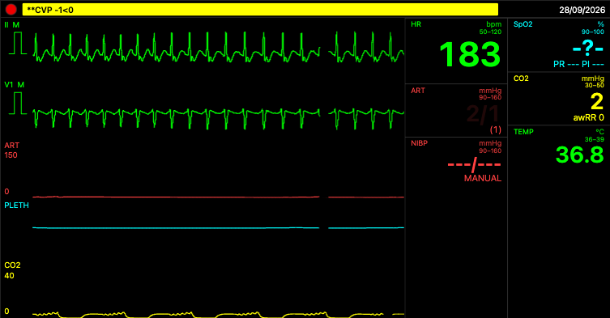
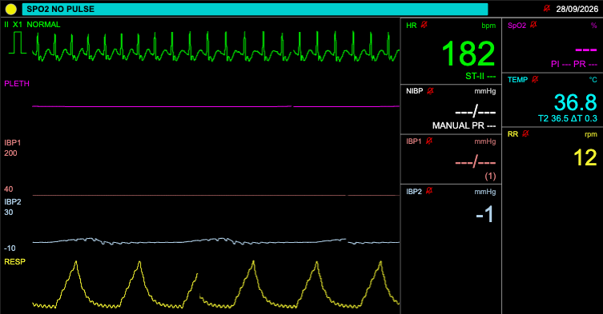
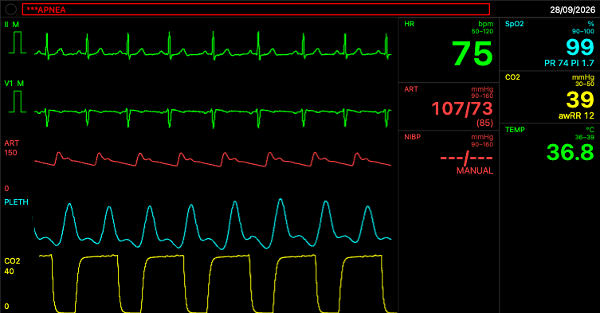
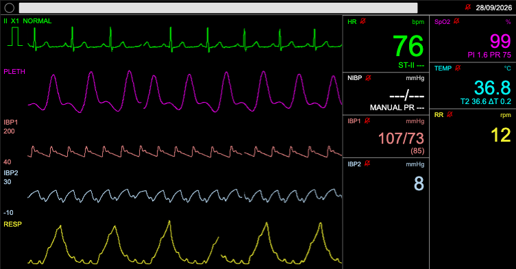
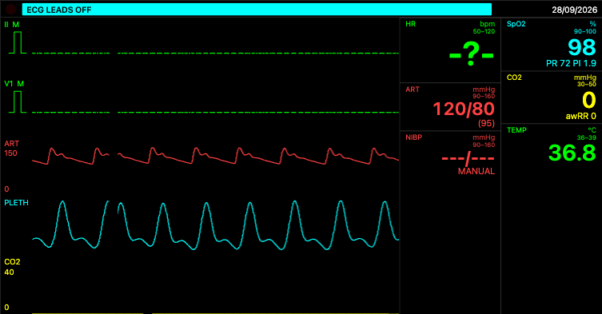
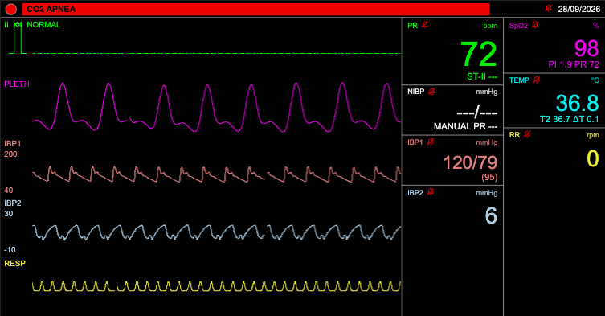
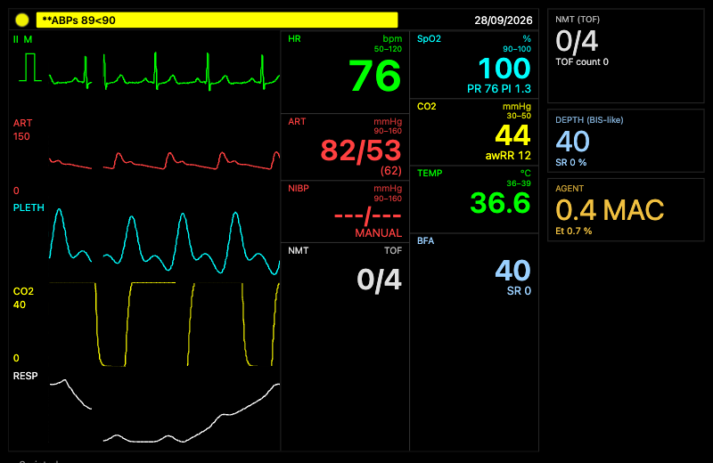
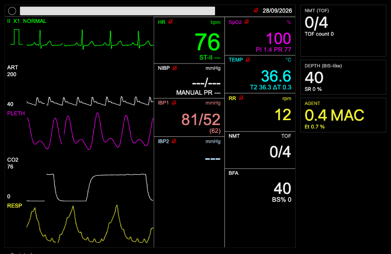

# Gate FU-5 — monitor fidelity: signal quality, alarm semantics, technical alarms, NIBP, skins

Branch `fu-5-monitor-fidelity` from `origin/main` `90468dd` (FU-3 merged; `4f4ce06` + `docs/RESUME.md` commits). Plan:
`docs/plans/fu-5-monitor-fidelity.md` (Tasks 0–18, R50-reviewed and fixed, "FU-5 plan FIXED" 2026-09-28 16:05), plus
**Task 9a** — the orchestrator's ruling on the plan's Open question 20 (the vendor ALARM ON-DELAY, never a suppressing
hold), executed between Tasks 9 and 10 (Deviation (a)). One commit per task, pushed after each; Tasks 0–14 by the first
executor, Tasks 15–18 re-done from the top by the resuming executor after the 12th cap. `origin/main` was merged at the
gate (`b8487b4`, then again after CI; `docs/RESUME.md` only — **FU-4 has not merged**, so Task 15 Step 3 did not trigger on `main`; a TRIAL
merge of FU-4's head was measured separately, §6 (c)). Every number below was measured on this branch unless marked
"plan" or "trial".

## 1. Summary

| Check | Result (merged tree `b8487b4`, local Mac, 8 cores, shared with other agents) |
|---|---|
| typecheck (all packages) | clean |
| fast set (`CI=1 PME_TEST_SET=fast pnpm -r test`) | audio 58, skins 179, engine-core 250 files / 1 124 passed / 1 skipped, ventilator 88, controller 215, renderer 25 files / 85, validation 107 passed / 11 skipped, demo 141 — all green (Task 15 run on `186bcc8`). On the merged tree the same counts, except one ventilator timeout (`ports.test.ts` "monitor side", 5 s default) while the slow set ran beside it; 922 ms when re-run alone (unchanged package, load) |
| slow set (engine-core, `CI=1 PME_TEST_SET=slow`) | 47 files / 238 tests passed on the merged tree (1 828 s, beside the fast set) and on `186bcc8` (1 483 s) — the six `fidelity-*` files (55 tests), `hemo-nibp`, `circ-hypoxic-arrest`, `circ-manual-cvp-peep` included |
| `pnpm build` / `pnpm check-notices` | OK / `check-notices: OK (3 governed files)` |
| e2e (`PW_SYSTEM_CHROME=1 pnpm test:e2e --workers=2`, system Chrome) | 39 passed, 1 skipped (`stage7d` gate screenshots, `PME_SHOTS=1`) in 16.6 min — the base's 32 + FU-5's 8 (6 `fu5-fidelity`, 2 `fu5-latched`); the run rewrote the other stages' committed evidence images, restored with `git checkout` |
| PR #24 CI on `9d32ba0` | `build` PASS in 39 min 03 s (inside ruling 10's 45 min, so the fu5 evidence tests stay on CI — no `PME_EVIDENCE` gate); its e2e share 18.4 min (80 tests over Chromium + WebKit, 60 passed, the rest the WebKit/`PME_SHOTS` skips); `test-slow` PASS in 1 h 12 min 26 s (47 files, inside the 90 min cap; was 47–52 min before FU-5 — the six fidelity files and main's growth) |
| tick bench (`packages/validation/test/perf/tick-bench.test.ts`) | passes; p50 0.50 / 0.54 / 0.62 ms, p95 0.61–0.89 ms over three runs (local bound 2 ms; load average ≈ 6) |
| `pnpm audit:monitor` (43 scenarios, seed 7) | EXIT 0; the after-report (`fu-5/audit-report-after.txt`) is byte-identical between the pre-cap run and this executor's run |
| `truth-event` | "future tree (12 drugs): 2031 leaves, 45 289 B" (plan: 2028 — Task 9a's pending on-delay state) |

## 2. Fidelity suite (research/10 §13) — before (Task 1, `origin/main`) → after (Task 15)

Skins: philips-like unless marked mr (mindray-like) / sa (saadat-like). Before/after = `pnpm audit:monitor`
(`fu-5/audit-report-before.txt` / `-after.txt`); the Vitest/Playwright test that asserts each item is named.

| # | Item | Source | Before | After | Asserted by |
|---|---|---|---|---|---|
| 1 | Low flow, 3 L bleed (A1m), +20 s after MAP < 30 | brief §4.3; [S2] p. 58–59, 120 | SpO2 "99" valid, PI 2.16, INOP none; pleth 140 % of rest; 96 % of rows plain-valid; 58 rows valid SpO2 with PR/PI invalid | "99?", PI 0.11, SpO2 LOW PERF; pleth 8 %; 0 % plain-valid; 0 rows | `fidelity-lowflow` 1; `fu5-fidelity.e2e` suite 1 (📷) |
| 1 | Low flow, Ali's case (A2) | same | "99" valid, PI 2.03; pleth 133 %; 100 % plain-valid | "99?", PI 0.14, LOW PERF; pleth 7 %; 0 % | `fidelity-lowflow` 1 |
| 2 | PEA (A5 ×3) | [S2] p. 57 (review ruling 3) | ART valid in 10 of 87 rows (the 118/79 glitch); ART INOP no; ART low alarms cleared during PEA 3 / 0 / 0 | 87 / 87 / 3 of 87 — philips-/mindray-like keep S/D/M of the flat line ("24/21 (22)"), saadat-like the mean; ABP NON-PULSATILE on every skin; `prAbp` invalid from +6 s; ART lows cleared during PEA 0 | `fidelity-arrest` 2, `numerics.test`, `fu5-technical` |
| 3 | VF → CPR → ROSC (A4 ×3) | [S2] p. 97, 99 | VFIB +3.0 s; HR_HIGH ×10 during VF; at 420 s mr EXTREME TACHY latched | VFIB +3.0 s; 0 other rate alarms; at 420 s philips-like VFIB + APNEA latched (silent), mr/sa none latched | `fidelity-arrest` 3 |
| 4 | Asystole (A6 ×3) | [S1] p. 50; [S4] | +4.1 / +4.1 / +10.1 s; HR LOW beside it (philips-like ×1) | +4.1 / +5.1 ([S4] 5 s) / +10.1 s; 0 | `fidelity-arrest` 4, 4b |
| 5 | Leads off (F1 ×2, F3) | [S2] p. 55, 108; research/06 §4.1 | HR {75, 0}, "0" in 56 rows; 1 HR alarm on reconnection | HR invalid ("--" in the harness, "-?-" on the philips-like tile, "PR" relabel on saadat-like), "0" in 0 rows; 0 alarms; LEADS OFF rotated into the bar under a red APNEA | `fidelity-ecg` 5, `alarm-view.test`, `fu5-fidelity.e2e` suite 5 (📷) |
| 6 | Apnoea 60 s (D1 ×3, F2) | [S2] p. 41; D5 | 2 raises (APNEA (RESP) 136.7 + APNEA 140.3); at 300 s both latched (audible) | 1 raise (140.3 / 141.5 / 140.6 s); at 300 s philips-like latched + silent, others cleared | `stage3-hooks` (R45), `fidelity-resp` 6, `fu5-fidelity.e2e` suite 6 (📷), `fu5-latched.e2e` (📷) |
| 7 | Impedance-only apnoea (D4) | [S2] p. 112–113; D13 | RR {0, 3, 44, 49, 51, 50, 48, 43} = the HR; 1 RR alarm | RR {0, 1}; APNEA 251 of 251 rows; RR alarms 1 (RR LOW ×2 raises while the impedance APNEA flickers latched — Open question 20 residual) | `impedance.test`, `fidelity-resp` 7 |
| 8 | Disconnect / oesophageal (D2); probes (G2) | [S2] p. 44, 53, 57, 62 | +20.3 s / +24 s; G2 {-} {ART_D_HIGH} {3 ART LOW} {-} | +20.3 s / +24 s; G2 {tempProbeOff} {abpZero} {abpDisconnect abpNonPulsatile} {co2Line} | `fidelity-resp` 8, `fu5-technical` |
| 9 | Desaturation lag (A8, A8e) | [S1] p. 66; [S2] p. 301 | finger 22 s, ear 12 s; DESAT 216.0 / 206.0 | 22 s / 12 s; DESAT 218.0 / 208.0 (+2 s: philips-like 10 s average, 2 s update) | `fidelity-resp` 9 |
| 10 | NIBP | D12 | PP 10 (C3) FAILED; A1m 1 result / 19 failed; ladder 2 / 3; AF 110/73, 111/75 | C3 80/56 (69); A1m 8 results down to 53/40 (38) / 12 failed; ladder 3 / 2 (67/37 at MAP 43); AF 125/78, 117/67 | `nibp.test`, `fidelity-nibp` 10 (2 `it.fails`, §4) |
| 11 | Limit hygiene (G1, E1, chatter) | D9, Task 9a | CVP 10>10 ×100 (A1), G1 HR_LOW 11× in 180 s, "**CVP 10>10", A2 ART_M_LOW ×71; 1 372 raises over the 43 scenarios | A1 CVP 0; G1 CVP_M_HIGH 1 (the start-up hover), HR_LOW 0 (3 s on-delay), "**CVP 11>10", "**Temp 35.9<36.0"; A2 ART S/M/D LOW 2/3/1, ABP NON-PULSATILE 1; 369 raises over the 43 scenarios | `fu5-limits`, `fu5-ondelay`, `text.test`, `fidelity-alarms` 11 (CVP tour `it.fails`, §4) |
| 12 | HR response (B2 ×3) | IEC 60601-2-27; [S1] | 8/7/11, 7/7/10, 10/9/10 s | unchanged | `fidelity-ecg` 12 (saadat-like `it.fails`, §4) |
| 13 | Rhythm tour (B1 ×3, B1a) | [S2] p. 97, 99; [S4] C.1.1.2 | VTAC +1.6 s; PAUSE 10× shortest 0.0 s (mr and arrhythmia on) | VTAC +1.6 s (mr +1.9 s, 6 PVCs); PAUSE 7× shortest 5.0 s (B1a), mr ×0 (factory Off) | `fu5-conditions`, `fidelity-ecg` 13 |
| 14 | Silence then a new red alarm (F4 ×3) | [S2] p. 11, 32; [S4] §10.8; research/06 §4.2 | philips-/mindray-like: the new VFIB muted under a running silence; saadat-like sounds | all three: the new VFIB sounds, silence not running; philips-/mindray-like earlier alarms acknowledged (A) | `fu5-latching`, `fidelity-alarms` 14, `stage4b-device.e2e` (R45) |
| 15 | Start-up, t < 15 s | D17 | `**ABPd 0<50` and `**etCO2 0<30` on every ventilated run | none (G1's CVP 11>10 is the hover scenario's own set-up) | `fidelity-alarms` 15 |

The harness's item 13 "max arrhythmia alarms at once" counts latched entries (philips-like 3 after); the Vitest item 13
asserts ≤ 1 LIVE lethal/extreme alarm.

**Headline rows the report asks for:**

| Row | Before | After |
|---|---|---|
| 3 L bleed, SpO2 / PI at +20 s after MAP < 30 | "99" valid / 2.16 | "99?" / 0.11 + SpO2 LOW PERF (then NON-PULSAT.; "-?-" on the tile at sim 330 s in the e2e) |
| One apnoea, one alarm (D1) | 2 raises, both latched audibly | 1 raise; philips-like latched silent, others cleared |
| Leads-off HR (F1) | "0" in 56 rows, 1 alarm on reconnection | invalid ("-?-" / PR relabel), 0 alarms |
| NIBP at PP 10 (C3, 77/67) | FAILED | 80/56 (69) — MAP within ± 8 of the line (S/D vs the instructor's 77/67: `it.fails`) |
| CVP chatter | A1 ×100, B1 ×87, A4/A6 ×39, C2 ×42 | A1 0, B1 4, A4/A6 1, C2 0; G1 hover 1 (at the limit itself 0) |
| EXTREME BRADY in an agonal rhythm | review's merged FU-4 tree: A2 ×11, A1m ×7; mindray agonal ASYSTOLE ×15 | this branch: `fidelity-arrest` 4b ASYSTOLE ×1, EXTREME BRADY 0, HR LOW 0 on all three skins; harness A2/A1m EXTREME BRADY 0 (no arrest on this truth). Trial merge with FU-4 `e3eeb56`: A2 EXTREME BRADY ×3 (3.3 / 3.1 / 3.6 s cycles, each after the latched ASYSTOLE's condition ended), A1m ×1 — §6 (c) |
| Latched APNEA visibility (philips-like) | two live alarms, no latching shown; FU-3's 7f run: a live-looking, audible "APNEA (RESP)" | harness (D1, `barView` every sim-second): latched APNEA on the bar in 104 of the 116 rows in which it is latched (185–300 s; the other 12 are the live `**RR 4<8`'s turns), never with the red lamp; e2e 7f run: live 181–186 s, latched 188–457 s (to the end of the run; three runs: 182–184 / 186–456, 183–186 / 188–458, 181–186 / 188–457) |

## 3. Screenshots (`docs/gates/fu-5/`, Chromium / system Chrome, time × 4)

| File | Bytes | Scale | Sim time | Shows |
|---|---|---|---|---|
| `fu5-lowflow-philips-like.png` | 32 647 | 0.7 | 330 s (3 L bleed over 180 s from 20 s) | SpO2 "-?-" (PR/PI "---"), ART "2/1 (1)" (the flat line kept and flashing, review ruling 3), HR 183, EtCO2 2; SpO2 INOP active (asserted); the bar on `**CVP -1<0`'s turn |
| `fu5-lowflow-saadat-like.png` | 38 924 | 0.7 | 330 s | SpO2 not a plain number; SpO2 INOP active |
| `fu5-latched-apnoea-philips-like.png` | 42 623 | 0.7 | ≈ 192–196 s (apnoea 30–90 s; after 8 s wall of sampling from 160 s) | "***APNEA" LATCHED: red text framed on the idle bar, lamp off, no tone, while the capnogram breathes |
| `fu5-latched-apnoea-saadat-like.png` | 55 027 | 0.7 | ≈ 160 s | no APNEA on the bar (saadat-like does not latch) |
| `fu5-leadsoff-philips-like.png` | 36 879 | 0.7 | ≈ 58–78 s | HR "-?-" with the leads off; ECG LEADS OFF rotated into the bar under the red APNEA (asserted) |
| `fu5-leadsoff-saadat-like.png` | 52 394 | 0.7 | ≈ 58–78 s | the HR tile relabelled "PR 72"; "CO2 APNEA" on the bar's turn (ECG CHECK LA/RA/LL asserted in the rotation) |
| `fu5-fu3-latched-philips-like.png` | 50 663 | 0.8 | 460 s (7f induction) | the FU-3 run on the FU-5 tree: the bar on the live yellow `**ABPs 89<90`'s turn — the latched APNEA alternates with it every 2 s to the end of the run (logged spans in the full run, click at sim 3.0 s: live 181–186 s, latched 188–457 s, bar at the end "**ABPm 69<70") |
| `fu5-fu3-latched-saadat-like.png` | 51 370 | 0.8 | 460 s | APNEA live 183–184 s, then nothing (click at sim 1.0 s) |

**The FU-3 screenshot, before and after (G-FU3 ruling 7).** Before: `docs/gates/fu-3/fu3-neuro-tiles-philips-like.png`
— FU-3's gate found a red, live-looking, audible "APNEA (RESP)" on philips-like while the ventilator breathed. After:

"APNEA (RESP)" never appears; one APNEA text; from the bag's breaths on (click + 189 s) every APNEA sample on
philips-like is `data-latched="true"` and never with the red lamp, and one is seen at sim ≥ 440 s.

## 4. `it.fails` (all FU-5's, each failing as expected in the runs above)

| Test | Criterion | Measured | Why / owner |
|---|---|---|---|
| `fidelity-lowflow` 1b | ventilated normal patient (MODELED, PPV from 1 s): rest PI within ± 5 % of `origin/main` 1.80 | 1.49 (−17 %) | SV₀ is the spontaneous settle (80 mL) against 68 mL under PPV; PI follows SV only — R-FU5-9 (FU-4 cutaneous tone), ruling 1 |
| `fidelity-lowflow` 1b | propofol 2 mg/kg (ventilated): PI RISES after induction | 1.49 → 1.17 (−21 %) at 180–240 s (MAP 96 → 86, SV 68 → 55) | same — R-FU5-9 |
| `fidelity-ecg` 12 | saadat-like HR 80 → 120 within 8 s (B9 M p. 65–66: 6 s ± 2) | 9 s | ruling 5; Open question 12 (Ali's stopwatch) |
| `fidelity-nibp` 10 | PP 10: cuff S/D within ± 8 of the instructor's 77/67 | 80/56 (PP 24); the truth reaches only 81/62 (the MANUAL tracker) | ruling 5; Open question 5 |
| `fidelity-nibp` 10 | AF 150, 11 cycles: \|SBP bias\| ≤ 6 against the TRUE radial pressure | +10.8 (first two readings +24, +13; DBP +2.7) | the truth beat-mean counts AF's non-ejecting beats (FU-4 T2); against the displayed line: SBP +0.1, DBP +3.6 (passes) |
| `fidelity-alarms` 11 | CVP_M_HIGH ≤ 2 raises in the 11-min MANUAL rhythm tour | 4 philips-like, 4 mindray-like (11 / 9 before Task 9a's on-delays) | the displayed CVP swings 9–11 across the limit 10 with ventilation and rhythm, wider than D9's one-unit hysteresis — ruling 5 |

Pre-existing (FU-3) `it.fails` whose title FU-5 re-stated: `circ-manual-cvp-peep` "the 8a soak patient … max < 9.5 and
no CVP_M_HIGH in 120 s (measured max 10.17; FU-5: no raise since the displayed 10 is not above the limit — was
27–57 s)" — still failing on its max criterion.

The trial merge with FU-4 (§6 (c)) flips none of these.

## 5. R45 re-statements (existing tests FU-5 edited; no band widened)

| Test | Old → new | Ruling / source |
|---|---|---|
| `l3/alarms/profile.test` | IEC silence gains `mode: 'mute'`; latching `false` → `{ visual: 'off', audible: 'off' }`; philips-like 90 s silence / 180 s pause / latching `true` → Silence = acknowledge, 120 s pause, latching `{ visual: 'red', audible: 'off' }` | D3, D4; [S1] p. 135–136, [S2] p. 11, 32 |
| `l3/alarms/manager.test` | "IEC-style latching" also asserts `sounding: false` (visual-only #H30); "IEC-style silence (90 s)" → "mute silence (90 s, zoll-like)" | D3, D4, D16 |
| `l3/alarms/stage3-hooks.test` ×3 | two apnoea alarms (`apnoea-co2` + `apnoea-resp` "APNEA (RESP)") → ONE from the active source; Saadat CAPNO/RESP selects one; CO2 line text per skin | D5; [S2] p. 41, 53; research/06 §4.1 |
| `l3/alarms/text.test` | + the tile's decimals ("**Temp 35.9<36.0", "**CVP 11>10") | D9 |
| `l3/pressure-numerics/numerics.test` | a flat line's mean `questionable` → static pressure (mean valid, S/D per `staticDisplay`) | D11, ruling 3; [S2] p. 57 |
| `l3/pulse/detector.test` | the unused `prSource` stub's assertions removed with the stub | D14 (Task 4) |
| `l3/hr.test`, `co2-numerics.test`, `nibp.test`, `resp/impedance.test` | new cases only (no old expectation changed) | M16, M14, M4, M10 |
| `engine/hemo-engine.test` | probe off: `pr` valid (arterial fallback) → `pr` invalid + `prAbp` valid | M12, E-FU5-3 |
| `engine/alarms-engine.test` | philips-like HR limit alarm "at the first displayed value (no added delay)", target 150 → 3 s after it (IntelliVue system delay, [S2] p. 28, 294), target 130 (150 crosses the extreme threshold within the delay); age band HR 140 → 135 (below the extreme threshold, ruling 7), NO acknowledge (ruling 2), EXTREME TACHY at 3 s from the first HR average 144 (the sinus-arrhythmia peak), HR HIGH ≤ 13 s (was ≤ 10; Task 9a); leads off: HR invalid, never "0" | D7, D8, rulings 2, 7; Task 9a |
| `engine/circ-manual-cvp-peep.test` ×2 | the `it.fails` title (above); CVP 18: mindray-like now has a limit (factory 0–10, [S4] App. C.1) | D9, ruling 5 |
| `renderer/alarm-view.test` | the silence/rotation case moved to zoll-like (mute + countdown); philips-like Silence acknowledges (no countdown); + latched style, rotation under a live yellow, LEADS OFF under red, mindray split field | D4, D15, ruling 4 |
| `renderer/alarm-audio.test` | + a latched visual-only alarm is silent; a new alarm after an acknowledge sounds | D16 |
| `skins/fu1-layout.test` | ge-/mindray-like layouts equal → lanes and tiles equal; mindray-like documents split alarm areas | [S4] §3.6 |
| `apps/demo/e2e/stage4b-device.e2e` ×2 | philips-like Silence: countdown → acknowledged (no timer, VFIB still active and silent); flash-rate test HR 150 → 130 (150 is EXTREME TACHY now) | D4, D7, ruling 7 |
| FU-5's own new tests re-stated by the R50 fixer | fu5-conditions hover case, fu5-technical ABP case, alarm-view latched case, fidelity-arrest PEA, the two latched-APNEA e2e assertions | rulings 2–4, 6 |
| Task 9a re-measures (FU-5's own tests) | `fu5-limits` CVP raised at 63 s (was 60); `fidelity-alarms` 11 CVP start-up raise 14 → 17 s (window 15 → 15 + 3 s); HR 49–51 hover raises 4 → 0 (philips-like 3 s, mindray-like 6 s delay); CVP tour `it.fails` 11/9 → 4/4 | ruling on Open question 20 |

## 6. Deviations

- **(a) Task 9a added** (commits `6b418b5`, `d800179`) — the orchestrator's ruling on Open question 20: the vendor alarm
  ON-DELAY for limit alarms (philips-like 3 s: [S2] p. 28 system delay, p. 294 "less than 3 s"; SpO2 10 s [S1] p. 66;
  mindray-like 6 s [S4]; saadat-like 1 s research/06; IEC default 0 s [ENG]); a pending delay is the plain limit
  compare, the one-unit hysteresis holds only a RAISED alarm (Mindray: "if the alarm condition is resolved within the
  delay time, the monitor does not present the alarm", [S4] §10.6.5). New test `fu5-ondelay` (HR hovering on the 140
  extreme threshold: no 1–3 s HR HIGH blips; without the delay 1, 2, 3, 1, 2, 3 s). Consequence: the after-report
  differs from the plan's "After the R50 review fixes" table where the delay acts — G1 HR_LOW 4 → 0, A5-pea ART lows
  cleared during PEA 1 → 0, A4-vf at 420 s no CVP_M_HIGH, the chatter rows (A2 ART_M_LOW 12 → 3, the A2/A8 `**HR`
  HIGH blips ×7/×4 → 0/0 besides the one before EXTREME TACHY) — every other row matches the plan to the unit.
- **(b) `fu5-latched.e2e.ts`** (Task 17) differs from the plan's block in two places: the spans are logged BEFORE the
  assertions, and "from sim 190 s" is anchored on the click (`tClick + 180 + 9`; the 7f script's times are relative
  to the click, `at(dt)` = `simT + dt`). The first run (two workers, loaded machine) failed philips-like's
  "every APNEA sample from 190 s is latched, never with the red lamp" without recording the samples; the unchanged
  tree then passed three times (clicks at sim 1.1, 1.1 and 3.0 s; spans in §2). The
  criterion is unchanged (identical to 190 at a click at 1 s).
- **(c) FU-4 has not merged**, so Task 15 Step 3 / Task 18's merged-tree re-measure ran on a TRIAL merge of
  `origin/fu-4-integration-polish` `e3eeb56` (FU-4's Tasks 0–18d; 18e uncommitted there) in the executor's scratch —
  one conflict, `truth.ts` `SKIP_PATH`, resolved as the union (R-FU5-2); typecheck clean. On that tree:
  - `audit:monitor` A2 (Ali's case): ASYSTOLE ×1 at 937 s, then EXTREME BRADY ×3 (948–951, 989–992, 1000–1004 s)
    — each a 3–4 s cycle raised when two beats closer than 2.5 s end the ASYSTOLE condition (the entry stays latched)
    and cleared by the chain when the asystole returns; A1m: ASYSTOLE ×1 (893 s), EXTREME BRADY ×1 (956–960 s). The
    review's merged tree had A2 ×11, A1m ×7 before the agonal hold.
  - The six `fidelity-*` files: 51 of 55 pass; **4 fail on FU-4's truth** — (1) `fidelity-lowflow` 3 L bleed:
    `spo2LowPerf` raise/clear cycle 1.0 s at 601 s (the no-technical-flicker guard); (2) `fidelity-lowflow` Ali's case:
    EXTREME_BRADY 3.3 s cycle at 948 s (+2 more) — the guard ruling 6 asked for (review F9); (3) `fidelity-arrest` 2
    PEA: HR − electrical rate 4.3 > 3 (FU-4's PEA now decays to asystole, `f0e6908`); (4) `fidelity-resp` 9 ear lag
    13 s > 12. No `it.fails` flips. These are for whichever branch merges second (Global Constraints, R-FU5-2): the
    device criteria are FU-5's, so (1) and (2) are FU-5 follow-ups on the new truth (the extreme-rate clear by chain
    suppression after a latched ASYSTOLE; the LOW PERF clear hysteresis at a PI hovering 0.3–0.4), (3) and (4) are
    re-statements with the new truth's numbers (R45). Not fixed here: FU-4's head is moving and its truth is not on
    `main`; Open question 21.
- **(d)** `truth-event` reads 2031 leaves (plan 2028): Task 9a's pending on-delay state (the test's bound holds).
- **(e)** The fast set on the merged tree was run beside the slow set: one ventilator timeout (`ports.test.ts`,
  5 s default, 922 ms alone). The Task 15 fast run (alone) was fully green with the same code.
- **(f)** Commit trailers: Tasks 0–15 carry "Claude Fable 5.1" (the first executor's, and Task 15 by this executor
  following the relaunch message); Tasks 16–18 carry this executor's own model name per ruling 9 ("the executor's own
  model name"). The gate merge commit `b8487b4` carries git's default message.
- **(g)** The plan's checkboxes were not ticked by the first executor; the gate ticks Tasks 0–18.

## 7. Open questions

The plan's list stands (for Ali: 1 his IntelliVue option, 2, 3, 4, 5 the cuff failure rate, 9, 11, 12, 14, 16;
decided: 1 presentation, 6, 7, 8, 13, 15, 19; FU-4: 10; Stage 9 or a later FU: 17, 18). Updates:
- **8 (chatter)** — with Task 9a's on-delay philips-like and mindray-like raise NOTHING for an HR wandering 49–51 on
  a limit of 50 (was 4 in 3 min each); the CVP tour chatter is 4/4 (`it.fails`).
- **20 — ANSWERED** (orchestrator, "FU-5 plan FIXED"): the vendor alarm on-delay, never a suppressing hold; executed
  as Task 9a. Residual: D4's RR LOW ×2 while the flickering impedance APNEA is latched is unchanged (yellow members
  still raise after the on-delay when the red parent's condition is absent).
- **21 — NEW (for the orchestrator, merge order):** on FU-4's truth (trial, §6 (c)) four FU-5 device criteria fail.
  If FU-5 merges first, FU-4's executor meets them at its merge; if FU-4 merges first, FU-5 re-runs Task 15 Step 3.
  Proposed: a FU-5 follow-up on the merged tree for (1) and (2) (device mechanisms: an EXTREME BRADY raised after a
  latched ASYSTOLE should not be cleared into a < 5 s cycle by the returning asystole — e.g. the returning ASYSTOLE
  condition re-raises the arrest alarm instead; the LOW PERF clear at PI ≥ 0.4 needs the same 5 s as the PI ≥ 0.3
  path) and R45 re-statements for (3) and (4).
- **22 — observation:** A7-probe shows PI 8.21 for one second when motion ends (181 s) — the PI of a motion-contaminated
  pulse; a candidate for Stage 9's device review with the agonal double detection (Self-review).

## 8. Coverage matrix (R54; research/12 §4.3, §7) — for R-FU5-7

Measured by `pnpm audit:monitor` on this branch (identical code on the merged tree); verdicts WR wrong, MI missing,
TW truth-wrong, PL plausible, IN inconclusive.

| Cell | Gap | Scenario (harness) | Before | After (measured) | Asserted by |
|---|---|---|---|---|---|
| A10-A1 PI with vasoconstriction | M1 | A1-map-ladder, D3-induction | WR | ladder PL (PI 1.84 → 1.53 → 1.18 → 0.03 as MAP 106 → 38); vasomotor direction **TW (PI follows SV only)** — propofol PI 1.49 → 1.17 (`it.fails`, R-FU5-9) | fidelity-lowflow 1b |
| A10-A1t tracker floor | M1 / T4 | A1-map-ladder | IN | device PL (LOW PERF 569 s → NON-PULSAT. 574 s at the 13 step); the MAP floor stays FU-4's (T4) | fidelity-lowflow |
| A10-A1m bleed 3 L, SpO2 at low flow | M1 | A1m-map-ladder | WR | PL ("99?", PI 0.11, LOW PERF; 0 % plain-valid) | fidelity-lowflow, fu5-fidelity e2e 1 |
| A10-A2 Ali's chain | M1 | A2-ali-b7 | WR | PL ("99?", PI 0.14; 0 % plain-valid) | fidelity-lowflow |
| A10-A4 VF/asystole/PEA SpO2 INOP | M8 | A4-vf, A5-pea | MI | PL (SpO2 NON-PULSAT. on every skin) | fu5-technical, fidelity-arrest |
| A10-A4c CPR "?" | M1 | A4-vf | WR | PL ("99?" drawn) | fu5-tiles, fidelity-arrest |
| A10-A7a probe off, PR source | M12 | A7-probe | WR | PL (`pr` "--", `prAbp` 74–77 valid, 61–90 s) | hemo-engine (R45), fu5-tiles |
| A10-A7b motion "?" | M1 | A7-probe | WR | PL (SpO2 "99?" 122–180 s, PR/PI "--") | fu5-tiles |
| A10-A8 desaturation display | M15 | A8-desat-finger | PL (0 % shown) | PL, unchanged (lowest shown 0; Open question 14) | fidelity-resp 9 |
| A10-B4 VF chaining | M7 | A4-vf(-mr) | WR | PL (0 other rate alarms during VF) | fu5-conditions, fidelity-arrest 3 |
| A10-B5 asystole chaining | M7 | A6-asystole | WR | PL (HR LOW/EXTREME BRADY 60–150 s: 0) | fidelity-arrest 4 |
| A10-B7 PAUSE flicker | M13 | B1a-rhythms-arrOn, B1-rhythms-mr | WR | PL (PAUSE 7× shortest 5.0 s; mr 0×, factory Off) | fu5-conditions, fidelity-ecg 13 |
| A10-B8 HR after asystole | M16 | B1-rhythms | WR | PL (no "3") | hr.test |
| A10-B9 leads off | M3 | F1-leadsoff(-sa), F3 | WR | PL ("0" in 0 rows; 0 alarms on reconnection) | fidelity-ecg 5, fu5-fidelity e2e 5 |
| A10-C2 PEA stale beats | M5 | A5-pea | WR | PL (static flat line "24/21 (22)", ABP NON-PULSATILE at +6 s, `prAbp` invalid; the 118/79 glitch gone) | numerics.test, fidelity-arrest 2 |
| A10-C3 flat-line indication | M5, M8 | A5-pea, A4-vf | MI | PL (ABP NON-PULSATILE; philips-/mindray-like S/D/M of the flat line, saadat-like the mean) | fu5-technical, fidelity-arrest 2 |
| A10-C5 over-damped line | — | C1-damp | TW | TW, unchanged (L2 transducer; Open question 18) | — |
| A10-C8 NIBP PP ≤ 20 | M4 | C3-lowpp, A1m | WR | PL (C3 80/56 (69); A1m 8 results / 12 failed) | nibp.test, fidelity-nibp 10 |
| A10-C11 CVP chatter | M6 | G1-hover, A1-map-ladder, B1-rhythms | WR | PL at the hover (0 at the limit itself; G1 1 raise at start-up) and A1 (100 → 0), C2 (42 → 0), A5 (37 → 1); B1 tour 87 → 4 still > 2 (`it.fails`) → **TW-device (partial)** | fu5-limits, fidelity-alarms 11 |
| A10-D2 one apnoea | M2 | D1-apnoea(-mr/-sa) | WR | PL (1 raise) | stage3-hooks (R45), fidelity-resp 6 |
| A10-D3 latching after resumption | M2 | D1-apnoea, F2-apnoea-ack | WR | PL (philips-like latched + silent, in the rotation 104 of 116 rows; others cleared; F2 acknowledged → cleared) | fu5-latching, fu5-fidelity / fu5-latched e2e |
| A10-D4 impedance RR = HR | M10 | D4-apnoea-imp | WR | PL (RR {0, 1}) | impedance.test, fidelity-resp 7 |
| A10-D8 start-up alarms | M14 | every ventilated run | WR | PL (none < 15 s) | fidelity-alarms 15 |
| A10-D9 RR/awRR visibility | M10 | (renderer) | MI | PL (philips-like CO2 "awRR") | fu5-tiles |
| A10-E2 TEMP LOW text | M6 | E1-temp | WR | PL ("**Temp 35.9<36.0") | text.test, fidelity-alarms 11 |
| A10-E3 temperature probe off | M8 | G2-probes, E1-temp | MI | PL (TEMP NO TRANSDUCER) | fu5-technical |
| A10-F1 philips-like Silence | M9 | F4-silence-new | WR | PL (acknowledge; the new VFIB sounds) | fu5-latching, fidelity-alarms 14, stage4b e2e |
| A10-F2 arrest storm | M2, M7 | A4-vf | WR | PL (A4-vf 71 → 12 raises; 0 chained) | fidelity-arrest 3 |
| A10-F3 skin declarations | M11 | (skins) | MI | PL (wired or removed with a CONTRACT note) | fu5-skins, fu5-tiles |
| A09-H6, A09-H11 (with FU-6) | R5 | — | TW / WR | H11's alarm flapping damped by D9's hysteresis, Task 9a's on-delay and D6's chain; the EtCO2 window is FU-6's (R-FU5-3) | fu5-limits, fu5-ondelay |

PL cells FU-5 must not break (research/12 §7), each with the harness line that shows it (before → after):

| Cell | What | Harness line | Verdict |
|---|---|---|---|
| A10-A0 | baseline SpO2/PI/PR | stable runs: SpO2 96–99, PR = HR ± 2, PI 1.8 (MANUAL/spontaneous; ventilated MODELED 1.49, `it.fails` §4) | PL, PI −17 % ventilated MODELED (noted) |
| A10-A5 | ROSC SpO2 recovery | A5-pea 302–340 s: SpO2 99 throughout, PI 0.33 → 1.15 at 305 s (was 0.37 → 0.28 at 310 s, 1.50 at 320 s) | PL, unchanged (PI back sooner) |
| A10-A7c | same-arm NIBP: SpO2 hold | A7-probe 300–325 s: SpO2 99 held, PR/PI dip during inflation (315–320 s) as before | PL, unchanged |
| A10-A8e | ear-probe lag | A8e 12 s → 12 s | PL, unchanged |
| A10-B2 | rhythm tour HR, VTAC | B1: VTAC +1.6 s → +1.6 s (mr +1.9 s, 6 PVCs [S4]) | PL, unchanged |
| A10-B6 | PEA HR/PR/SpO2 | A5-pea: HR mean 90, PR invalid +7 s, SpO2 +12 s → unchanged | PL, unchanged |
| A10-B10 | HR step response | B2: 8/7/11, 7/7/10, 10/9/10 s → unchanged | PL, unchanged |
| A10-C1 | ART accuracy on the MAP ladder | A1: ART = truth at every step (137/90, 135/82, 81/51, 60/39, 51/37) → unchanged | PL, unchanged |
| A10-C4 | ART during CPR | A4/A5 CPR 150–300 s: ART "102/34 (58)" before and after | PL, unchanged |
| A10-C6 | under-damped line, flush | C1-damp: `ART_D_HIGH` ×1 (was ×11), one 3 s ART S/M HIGH pair at the flush (215 s) | PL, unchanged |
| A10-C7 | NIBP accuracy, normal and hypotensive | A1 ladder: 133/89 → 137/80 against the line 135/82; 75/47 → 79/48 against 81/51; the MAP-47 step FAILED → 67/37 (43) against 60/39 (47) | PL (closer) |
| A10-C9 | NIBP in AF 150 | C2: 110/73, 111/75 → 125/78, 117/67; against the line SBP +0.1 / DBP +3.6 (passes), against the true pressure +10.8 (`it.fails` §4, FU-4 T2) | PL against the line |
| A10-C10 | NIBP INOP in VF/CPR, recovery | A4 ×3: NIBP 2 failed → 2 failed | PL, unchanged |
| A10-D1 | ventilated baseline EtCO2/awRR/RR | EtCO2 36–37, awRR 12, RR 12 → unchanged (EtCO2 now invalid until two breaths) | PL, unchanged |
| A10-D5 | disconnect / oesophageal CO2 apnoea | D2: +20.3 s / +24 s → unchanged | PL, unchanged |
| A10-D7 | EtCO2 in CPR and low flow | A4 CPR EtCO2 21–23 → 21–23 | PL, unchanged |
| A10-E1 | cooling 37 → 34 °C, T1 lag | E1-temp: TEMP LOW raised 250 s ("**Temp 35.9<36.0") | PL, unchanged (text: A10-E2) |
| A10-E4 | NMT/BFA tiles | fu5-tiles: saadat-like BFA "BS%" (the B9 alias of SR, D19); SQI/EMG extras removed (unmodellable, CONTRACT note) | PL |

A10-B1/B3/D6 are FU-4's (B3: sinus 30 still shows 48–50 — T1, `HR_LOW` 23 → 2 raises with the on-delay and
hysteresis), A10-E5 is Stage 9's.
