# Gate 5.1 — Rhythm morphology polish (date: 2026-09-26)

Gate question: **"Do the G5-obs strips now show what their labels say, measured and by eye?"**

Branch `stage-5.1-rhythm-polish` (worktree `scratch/wt-stage-5.1`), plan `docs/plans/stage-5.1-rhythm-polish.md` (ticked copy on this branch). Base `origin/main` at `d3027d0` (contains the plan's verified base `f88175d`; the only change since the plan's `2d59ee3` in the ECG paths was the new `test/helpers/resp.ts`, so every find/replace anchor matched exactly once). Stage 3 was already on main; Stage 4b merged into main while this branch ran and was merged in (`040391d`) before the gate — no conflicts except the plan file itself (main carried the unticked copy; the ticked copy was kept).

| Check | Result |
|---|---|
| Clean clone typecheck / test / build / check-notices / e2e | exit 0 on a fresh clone of the branch at `ccef1a6` (after the main merge; `install --frozen-lockfile`): engine-core **472** tests / 104 files, controller 185 / 32, skins 159 / 14, renderer 61 / 18, audio 58 / 10, validation 16 / 5; `check-notices: OK (3 governed files)`; `PW_SYSTEM_CHROME=1 pnpm test:e2e` **19 passed** |
| Baseline before any change (`d3027d0`) | engine-core 369, controller 185, skins 155, audio 58, renderer 35, validation 16 — all green |
| Stage 5.1 acceptance (tests below) | all pass; every number is measured on the generated waveform |
| Before/after strips | 22 pairs in `stage-5.1/` (`<key>-before.png` = Stage 5 strip, `<key>-after.png` = this branch), each ≤ 50 KB (largest `cpr-after.png` 50 238 B); strips now carry a faint 1 mm grid |
| Ali's list (Task 14) | none received by 2026-09-26 (PR #3: 0 comments, 0 reviews; no Ali strip items in the rulings after G5-obs) |

## Acceptance tests and measured numbers

Measured with the tests' own computations (a temporary measuring file, deleted before committing). "Stage 5" columns are the plan's measurements on the Stage 5 tree.

| Item | Test (file › case) | Stage 5 | Stage 5.1 measured |
|---|---|---|---|
| VF periodicity | `s51/vf-realism.test.ts` › vfCoarse … (20 seeds × 4 windows of 10 s) | ACF max 0.80 | **ACF max 0.446** (< 0.6) |
| VF bandwidth (−3 dB, estimator floor 1.47 Hz) | same | min 1.50, median 1.78 Hz | **min 1.81, median 2.76 Hz** (≥ 1.5, median ≥ 2.2) |
| VF visible in every lead | same | V1/II 0.24–0.36, V5/II 0.39–0.47 | **V1/II 0.41–0.79, V5/II 0.50–0.85** (0.4–1.0); I/II 0.12–0.34 (not a target) |
| VF course (R39 item 3) | `s51/vf-realism.test.ts` › R39 course (16 seeds, 20 s windows) | onset 0.8 mV; f 5.5 → 4.4 Hz at 10 min | **amplitude 1.31 / 1.00 / 0.75 / 0.57 / 0.355 mV** at 0/2/4/6/10 min (R39 1.2/0.9/0.7/0.55/0.33; ±20 %); **dominant frequency 5.57 / 5.05 / 4.67 / 4.20 / 3.89 Hz** (R39 5.5/5.0/4.6/4.3/3.9; ±0.25 Hz); coarse→fine at **753 s** (= 420·ln(1.2/0.2)) for seeds 1–3 |
| Stage 5 VF tests | `s5/vf.test.ts` (τ 7 min ± 20 %, τ with CPR ≥ 12 min, fine switch, asystole, epinephrine now a 6-seed mean) | — | all pass |
| Polymorphic VT V1 | `s51/vtpoly.test.ts` (40 seeds × 3 windows) | V1/II 0.25–1.59 | **0.54–0.92** (0.4–1.0) |
| RBBB | `s51/bbb.test.ts` › RBBB | tangent QRS 121 ms, R′ 0.50 mV | **QRS 148 ms; V1 r 0.16, S −0.76, R′ 0.80 mV at 104 ms after onset; V6 S −0.43 mV, 82.5 ms below −0.05 mV** |
| LBBB | `s51/bbb.test.ts` › LBBB | 135 ms, two V1 troughs | **QRS 152 ms; one V1 trough −1.00 mV, V1 max −0.02 mV; V6 min +0.09 (no q/S), 2 peaks; T V1 +0.27, V6 −0.38 mV** |
| Normal conduction | `s51/bbb.test.ts`, `s51/helpers.test.ts` | — | tangent QRS **85 ms** |
| STEMI 2 mm at J+60 (diagnostic filter, paired) | `s51/stemi.test.ts` (6 territories) | inferior II 0.14, III 0.20, aVF 0.17 | inferior **II 0.199, III 0.204, aVF 0.202 / aVL −0.104**; anterior **V2 0.193, V3 0.211 / III −0.075, aVF −0.060**; septal **V1 0.199, V2 0.204 / V6 −0.126**; lateral **aVL 0.204, V6 0.200 / III −0.237**; anterolateral **V3 0.205, V5 0.198 / III −0.071**; posterior **V1 −0.191, V2 −0.212** |
| STEMI 3 mm (demo default) | `s51/stemi.test.ts` › scales with mm | — | **II 0.299, III 0.306, aVF 0.303**, aVL −0.157 |
| STEMI through the MONITOR filter (report only) | — | — | inferior 2 mm: II 0.176, III 0.180, aVF 0.178, aVL −0.092 (≈ 12 % under-read, real monitor-mode effect) |
| K 8.5 sine wave | `s51/electrolytes.test.ts` › K 8.5 | QRS 224 ms, T/R 0.64, trough −0.17·R | **QRS 175 ms, R 0.74 / T 0.75 mV (T/R 1.01), trough −0.65·R, 0 ms isoelectric**, P absent |
| Osborn J (II / V5 / V3) | `s51/electrolytes.test.ts` › Osborn | 0.11 mV in II at 30 °C via a V3-sized kernel | 33 °C **0 / 0 / 0**; 32 °C **0.041 / 0.049 / 0.100**; 30 °C **0.122 / 0.148 / 0.300**; 28 °C **0.204 / 0.246 / 0.500** mV (monotone) |
| Paced / TCP capture complex | `s51/tcp-capture.test.ts` | tangent 133 ms | **155 ms; steepest limb 41 vs 162 mV/s sinus (25 %); V1 max +0.15 mV** |
| TCP demand rate (R30 / R-4b-2) | `s51/tcp.test.ts` › R30 | 68.4 ppm | **70 pulses / 60 s demand and fixed, all captured, 70 paced beats**; sinus 80 inhibits (0 pulses). Engine level through Stage 4b's pacer device (zoll-like, asystole, demand 70 ppm 90 mA): **70 spikes / 70 captured / 70 paced beats in 60 s** |
| TCP artefact | `s51/tcp.test.ts` › pulse artefact | one blunt 40 ms deflection | 50 mA: **II 2.80 mV, V1 2.66 mV, FWHM 8 ms, tail −0.31 / −0.36 mV** |
| TCP no capture | `s51/tcp.test.ts` › no capture | — | beats identical; samples bit-identical outside [spike − 25 ms, spike + 400 ms] |
| BreathClock (R-S3-3) | `s51/breath-clock.test.ts` | fixed 15/min clock only | default path bit-identical (hash equal); RR vs 10/min driver phase **r 0.849** (vs fixed clock −0.007; default vs fixed 0.827); wander dominant 1/6 Hz with the driver, flat after apnoea |
| Fingerprint | `s51/fingerprint.test.ts` (30 seeds) | per-wave rotations ±20°, amplitudes ±25 % | frontal axis offsets **−14.2° … +14.3°**; QRS width **−9.5 … +9.1 %**; P/QRS/T spatial amplitude within ±10 %; pairs (1,2)(3,4)(5,6)(7,8) differ ≥ 0.05 mV in II; each patient identical run to run; default `morphologyVariation` still 0 |

## Before / after gallery

Left: Stage 5 (`docs/gates/stage-5/<key>.png`). Right: this branch. 25 mm/s, 10 mm/mV, monitor filter unless the label says otherwise.

**vfCoarse** — Irregular from the first second (cycle length, amplitude and shape vary); V1 clearly visible (0.41–0.79 × II over 80 windows); larger (R39: 1.2 mV at onset). The left-edge swing is VF itself (seed 7: +1.95/−1.54 mV at 3.97/4.09 s), not an artefact.

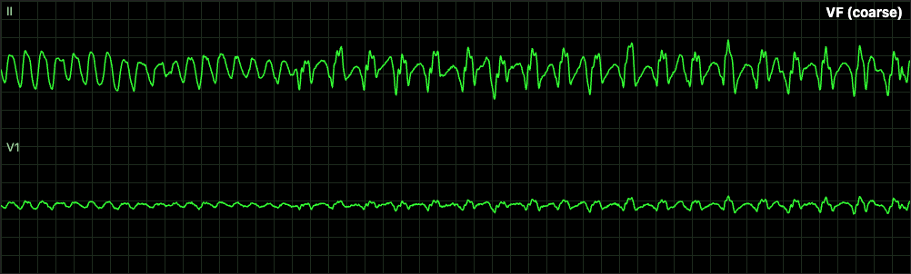 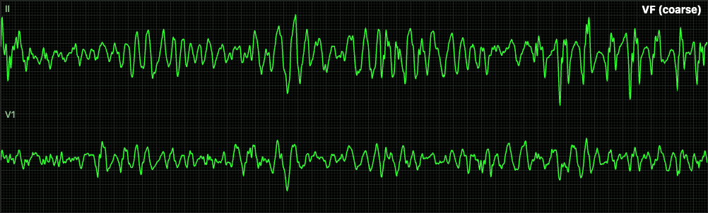

**vfFine** — Low-amplitude irregular undulation in both leads.

 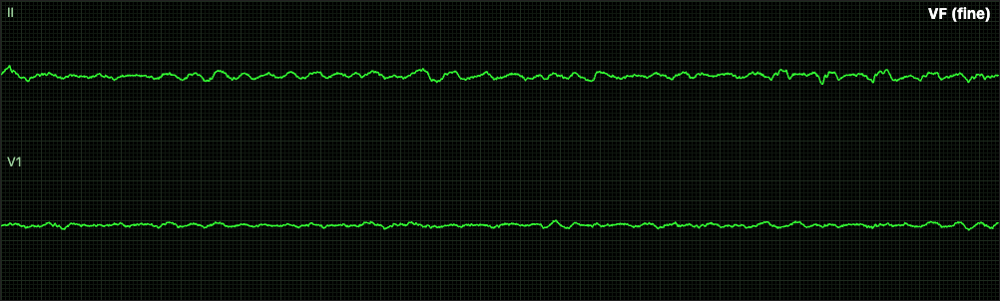

**vfEpinephrine** — Coarse, irregular, V1 visible.

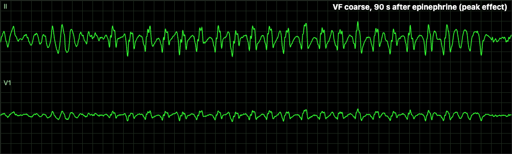 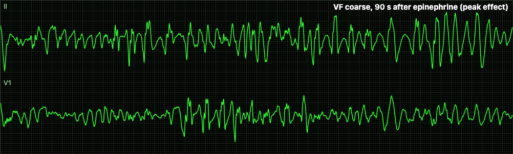

**cpr** — VF plus compression artefact. **For Ali:** the 110/min artefact is less conspicuous than on the Stage 5 strip, because VF is now 1.5× larger (1.2 mV vs the artefact's 1.28 mV at depth 0.6) and irregular; the catalogue's depth 0.6 → 1.0 would restore the Stage 5 look (not changed).

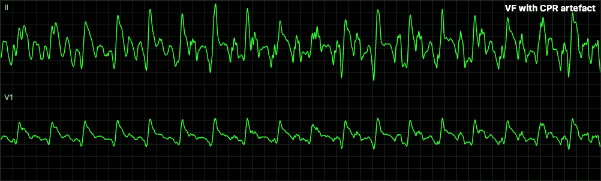 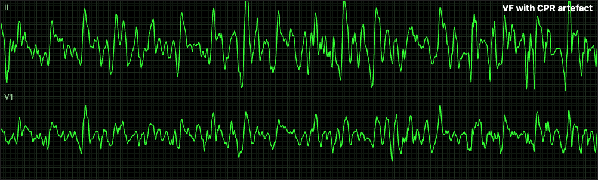

**shock** — Saturation and recovery, then VF continues; V1 visible.

 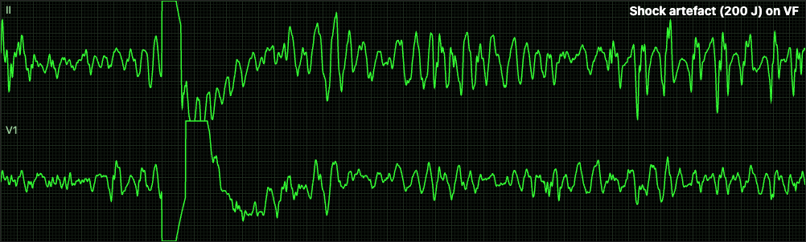

**vtPoly** — V1 never flat (V1/II 0.54–0.92); amplitude varies beat to beat in both leads.

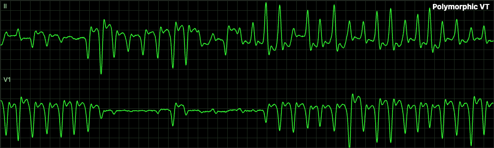 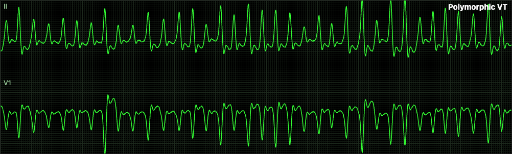

**torsades** — Twisting envelope in II and V1 (generator unchanged; shown for regression).

 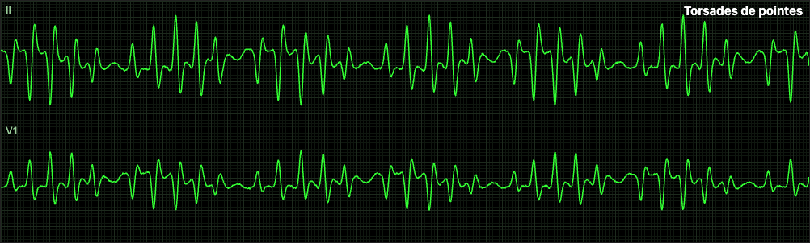

**rbbb** — V1: small r, S, then a tall broad R′ (rSR′); V6: R then a broad slurred S; QRS visibly wide.

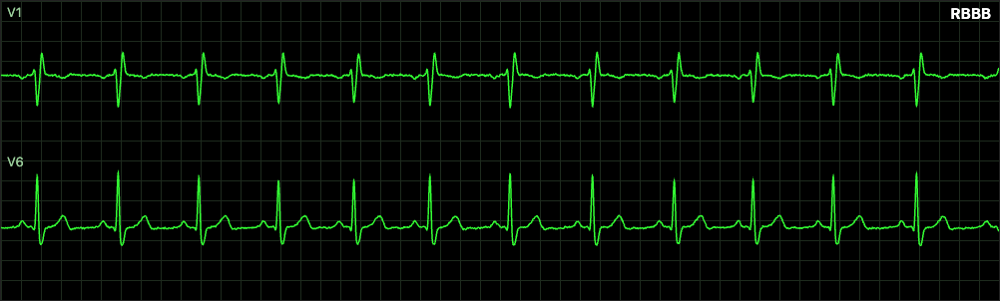 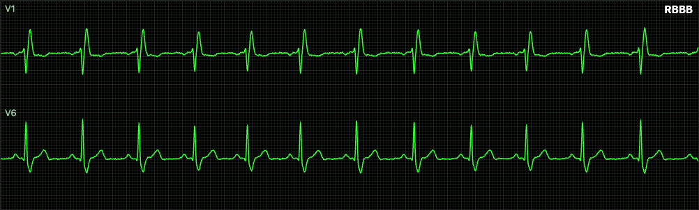

**lbbb** — V1: one broad QS trough with a slurred downstroke (no W); V6: broad notched (M) R, no q, no S; discordant T.

 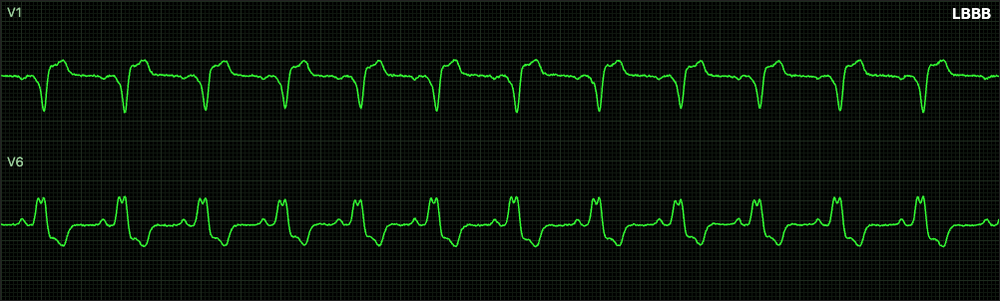

**pacAberrant** — The aberrant PAC shows rSR′ with the new tall R′ in V1.

 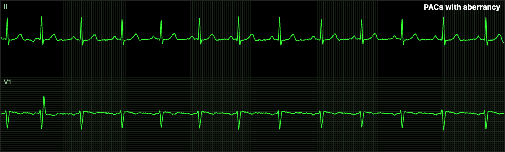

**stemiInferior** — ST plateau ≈ 3 small boxes in II with reciprocal depression in aVL. Diagnostic filter (label says so), so the EMG noise band is visible.

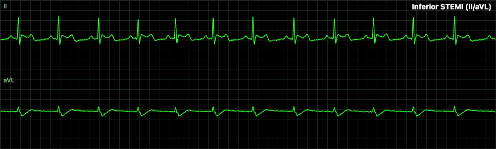 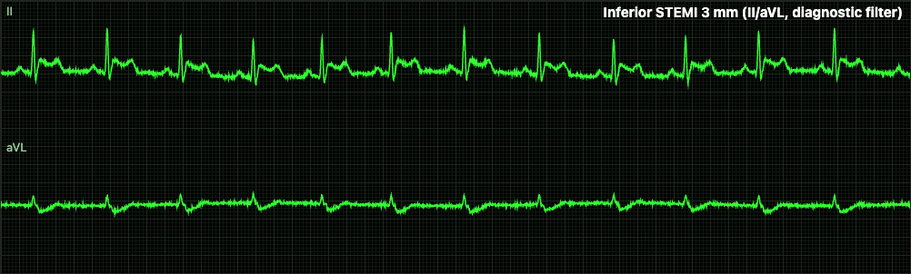

**stemiAnterior** — ST plateau ≈ 3 small boxes in V3; small reciprocal depression in III.

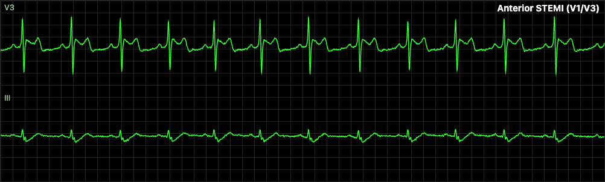 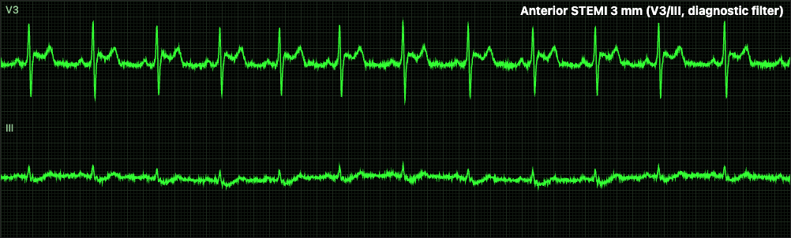

**hyperK** — K 7.2: peaked T (below the sine-wave onset at K 7.8; unchanged).

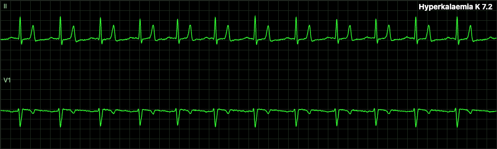 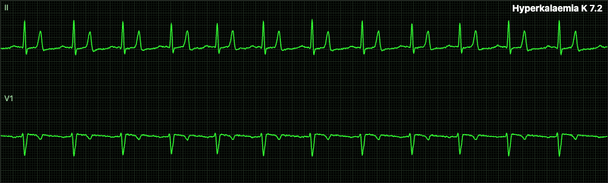

**hyperKsine** — R – deep S – broad T form one continuous oscillation with no flat ST; V1 broad.

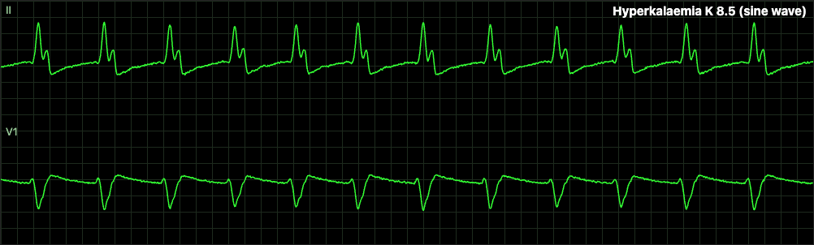 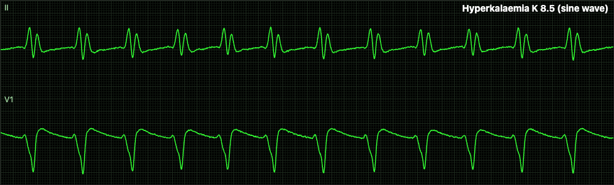

**osborn** — J hump at the end of the QRS in II and V3 at 28 °C (0.5 mV along V3).

 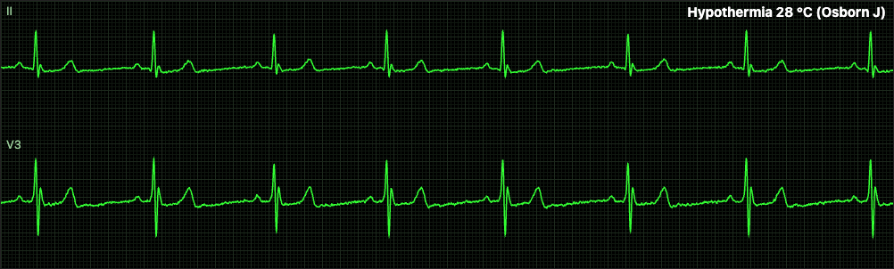

**tcpCapture** — Tall narrow spike (clipped at the lane top) with its white marker, then a broad, low-slope capture complex and T — no longer QRS-like.

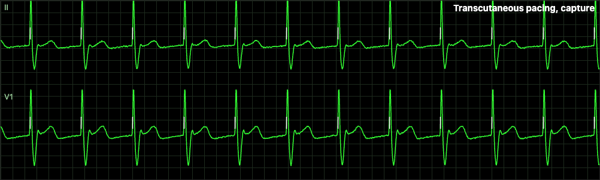 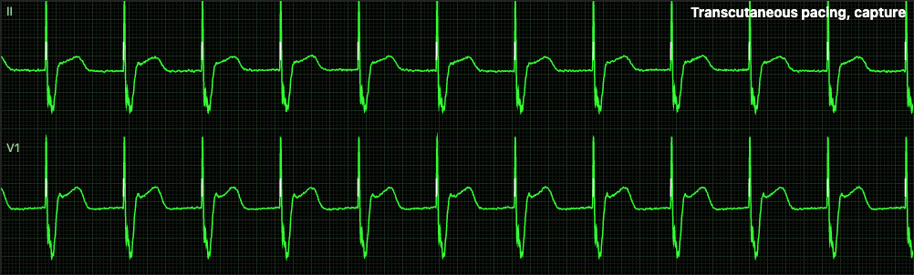

**tcpNoCapture** — Spike with a slow opposite-polarity tail and no complex (asystole underneath).

 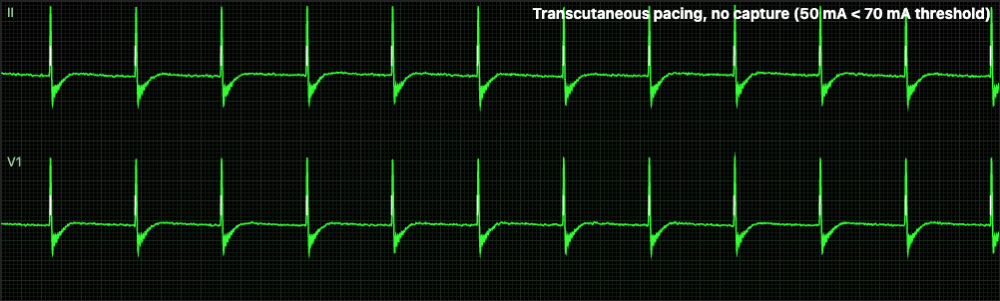

**pacedVVI** — Paced QRS broader and blunter (LBBB-like).

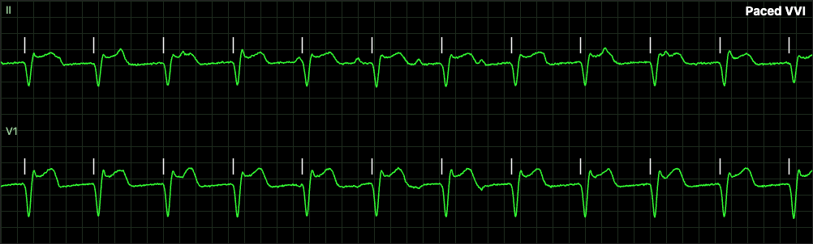 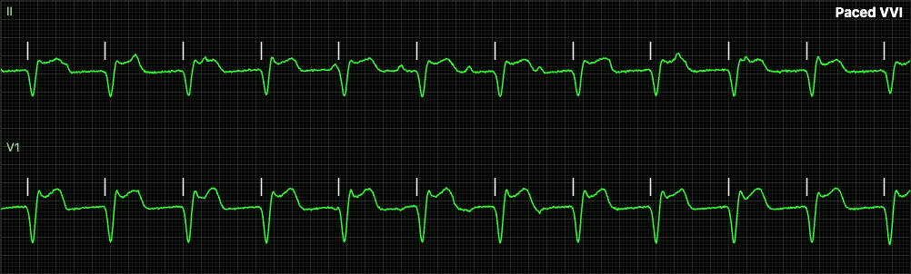

**pacedDDD** — Paced QRS broader and blunter; AV-paced markers unchanged.

 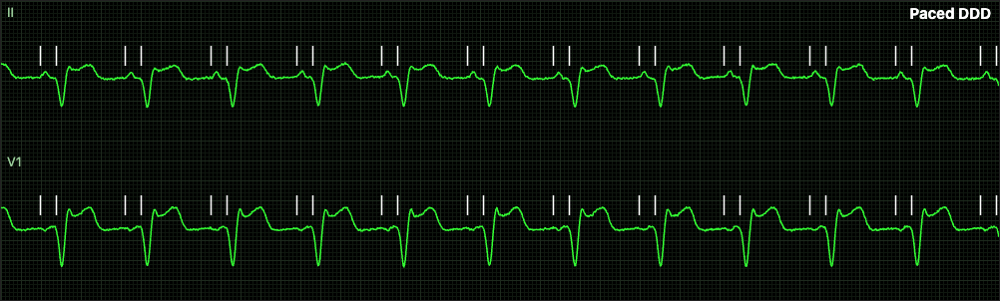

**failureToCapture** — Markers without complexes on non-captured pulses; captured complexes broader.

 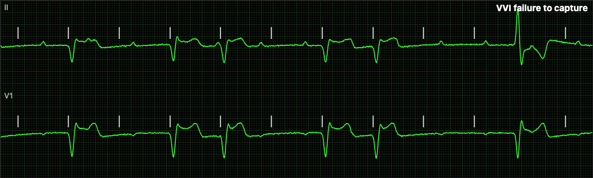

**individualityA** — patientSeed 3.

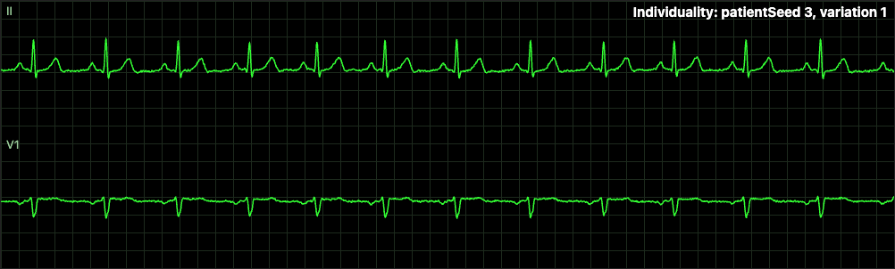 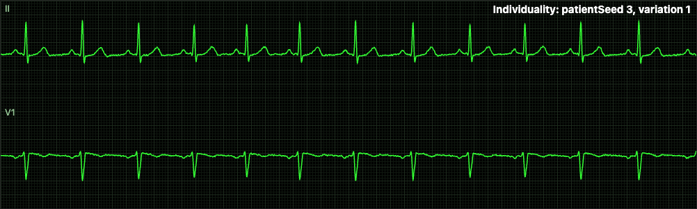

**individualityB** — patientSeed 4: differs from A mostly in amplitude (≈ 0.1 mV in II) — the Stage 5.1 bounds (±10 %, ±15°) are deliberately subtler than Stage 5's (±25 %, ±20°).

 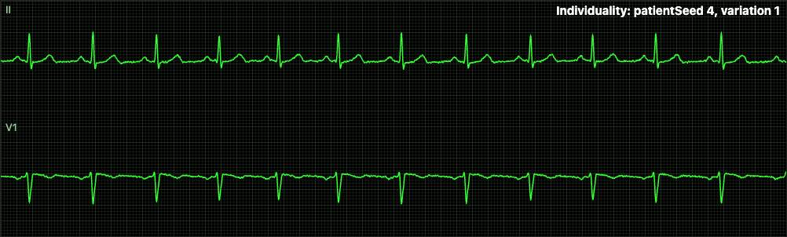

## Deviations

1. **R39 item 3 applied to the VF constants (orchestrator/caller instruction, beyond the plan):** `A0_MV` 0.8 → **1.2 mV**; `F_DROP_HZ` 1.5 → **2.25** (f_dom 5.5 Hz at onset → 5.0/4.6/4.3/3.9 Hz at 2/4/6/10 min with the unchanged 8 min time constant; was 4.4 Hz at 10 min); τ_A stays 7 min (R39 "other constants in band"; the measured course above is within 4–11 % of R39's amplitudes); `FINE_MV` stays 0.2 mV (R39: fine ≤ 0.2). Consequences in Stage 5's own test `s5/vf.test.ts`: `fExpected` uses 2.25, the coarse→fine switch is expected at 420·ln(1.2/0.2) = 753 s (the run is now 13 min), and the onset amplitude check is 1.0–1.4 mV (was > 0.6).
2. **VF frequency-jitter calibration (not in the plan):** the plan's per-cycle speed jitter (log-SD 0.18) raised the measured spectral peak by ≈ 4.7 % over f_dom (16 seeds: 5.83/5.17/4.99/4.44/4.09 Hz vs 5.51/5.05/4.61/4.36/3.89 Hz without jitter). `VF_FREQ_JITTER_BIAS = 1/1.047` scales the jittered speed back; a new test (`s51/vf-realism.test.ts` › R39 course) pins the measured course. VF periodicity/bandwidth/lead-ratio numbers above are after this change.
3. **Task 11 Step 7 (engine wiring of the breath driver) NOT applied, although Stage 3 is on main.** The wiring works — its own test (`test/engine/ecg-breath.test.ts`, RR vs emitted-breath phase r > 0.5) passes — but it moves beat timing, and Stage 2's NIBP acceptance "one adult cycle at HR 75 lasts 25–35 s (mean of 6 first cycles)" (`test/engine/hemo-nibp.test.ts`, Stage 2's file) fails at **36.5 s** (was 33.9 s). Over 12 seeds the mean is **35.50 s with the wiring and 35.52 s without**: the NIBP model's mean cycle is already above 35 s and the 6-seed test passes by seed choice. Editing another stage's acceptance band is outside this stage's partition, so the wiring is parked as `stage-5.1/r-51-2-engine-breath.patch` (`git apply` it; 2 imports + 2 marked hunks in `engine.ts` + the new test; re-verified after the Stage 4b merge) — see R-51-2 and R-51-5.
4. **TCP artefact vs brief §6.5:** the brief's "wide, blunt 20–40 ms deflection" is now a tall short spike (FWHM 8 ms) plus a slow opposite-polarity polarisation tail (G5-obs asked for "a large spike"; research 03 §1.7: monitors blank/filter the long pulse). The pace MARKER is unchanged (`marker { kind: 'paceSpike', data: { chamber: 2, captured, tcp: true, mA } }` from `l2/ecg/tcp.ts`).
5. **STEMI strips use the diagnostic filter** (labels say so): the monitor filter under-reads ST by ≈ 12 % (table above). The diagnostic band also shows the EMG noise.
6. **Bandwidth estimator floor 1.47 Hz** on a pure tone (Welch nfft 1024, Hann, 3-bin smoothing) — asserted in `s51/helpers.test.ts`; the VF test therefore also bounds the median.
7. **Comment fix:** `POLY_AXIS_KEEP`'s comment in the plan's code block said "SD 0.25/√(1−0.64) = 0.42 rad"; the code uses step 0.15 and keep 0.7, i.e. 0.15/√(1−0.49) = **0.21 rad (12°)**, as the plan's prose says. The comment was corrected.
8. **Strip rendering port:** the shots script's Vite port 5205 was swapped to 5213 for the runs only and reverted (concurrent stages).
9. No anchor misses: every "replace this block" in Tasks 2–13 matched exactly once on `d3027d0`.

Not changed (listed for Ali, as the plan decided): `qrsOverrideStage` — a 140 ms kernel span reads 128 ms by the tangent method; the CPR strip's artefact is now visually dominated by the larger VF (gallery note).

## Ali's list

None received by 2026-09-26 (PR #3 has no comments or reviews; the rulings have no Ali strip items after G5-obs). Executor's own items for Ali: the `cpr` strip look (above), the `qrsOverrideStage` width, and whether the subtler ±10 %/±15° fingerprint is enough individuality for teaching.

## Requests to other stages

| ID | Owner | Request | Status |
|---|---|---|---|
| R-51-1 | Stage 4b (renderer overlays) | Draw TCP pace marks (`marker.data.tcp === true`) on every lane of a pacer skin, taller than implanted-pacer marks; the sampled spike is now 3–6 mV and narrow, so the overlay must not be mistaken for it (draw 1–2 mm above the lane top, brief §3.5) | Open. 4b's `packages/renderer/src/overlays.ts` already tags `tcp` and shows it when the skin has a device pacer; height/placement not checked here |
| R-51-2 | Orchestrator | Apply `docs/gates/stage-5.1/r-51-2-engine-breath.patch` (engine.ts: `breath: breathOf(ps)` in `rhythmCtx()` and `ecgGenInputs({ ...ps, breath })`, + `test/engine/ecg-breath.test.ts`) once R-51-5 is decided | Open — blocked on R-51-5 |
| R-51-3 | L3 owner (`l3/qrs.ts`) | Pace-pulse rejection: during TCP the QRS detector counts pad artefacts (asystole + 50 mA fixed pacing reads HR 70). Blank detection ≈ 60 ms after each `paceSpike` marker, or use 4b's HR dashes | Open (true on Stage 5 too) |
| R-51-4 | Stage 4b | Their gate-note line "demand with capture runs at 68 ppm (R-4b-2)" becomes 70 ppm (measured above through their pacer device) | Closed by this branch |
| R-51-5 | Stage 2 owner / orchestrator | NIBP cycle duration: the model's mean adult cycle at HR 75 is 35.5 s over 12 seeds (band 25–35); the 6-seed test passes by seed choice. Either shorten the cycle model or measure over more seeds / widen the band; then apply R-51-2 | New |

## Sources and clean room

Plan `docs/plans/stage-5.1-rhythm-polish.md`; rulings G5-obs, R17, R18, R29 (R-S3-3), R30, R39 item 3 (`research/00-orchestrator-rulings.md`, `research/09-evidence-rulings.md`); `docs/gates/stage-5.md`; `docs/DESIGN-BRIEF.md` §3.5, §4.1, §5, §6.5; research 03 §1.6–§1.8 and 04 §5 as cited in the plan. The Dower rows in `vcg.ts` are the only lead model used. **No ECGSYN (C/MATLAB/any port), NeuroKit2 ECGSYN or GPL/unlicensed code was opened** by this executor; the planning scratchpad was consulted only for its plan-author tree when needed (it was not needed: every anchor matched).
