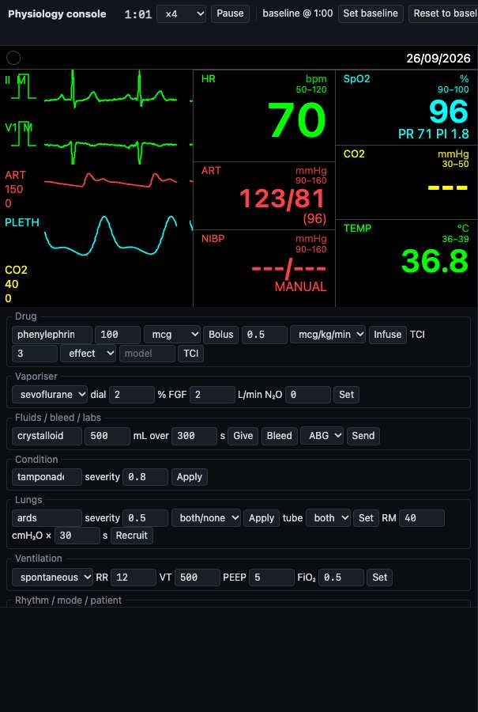
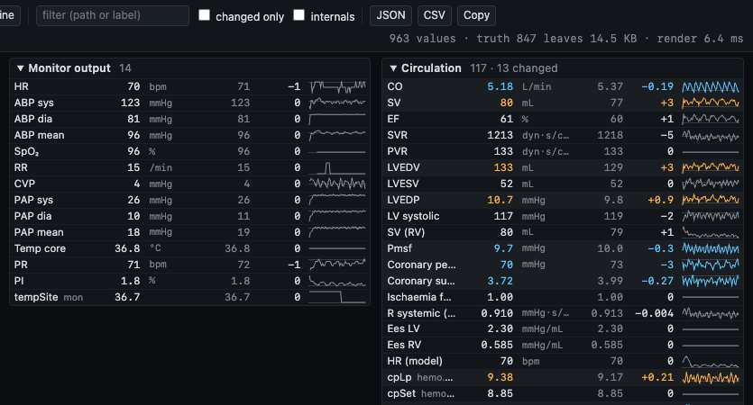
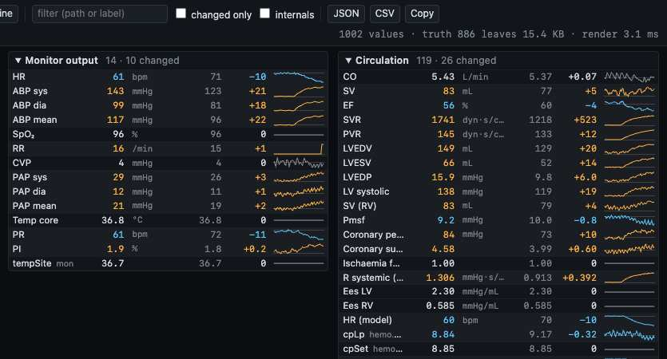
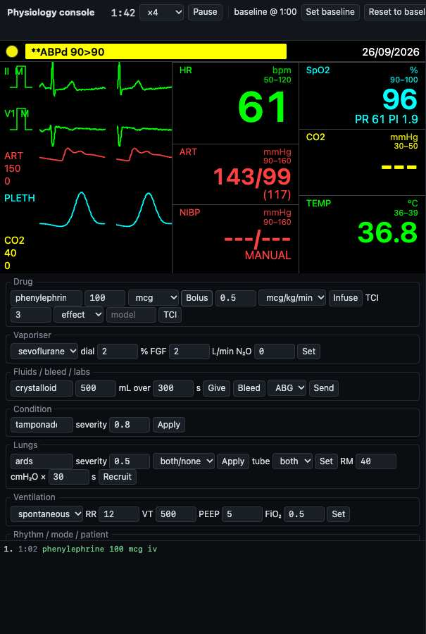
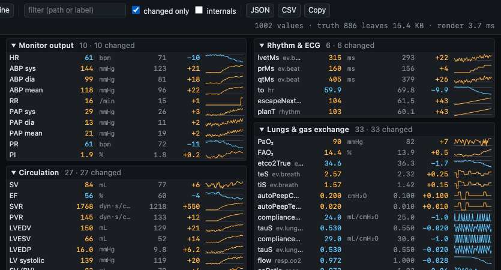
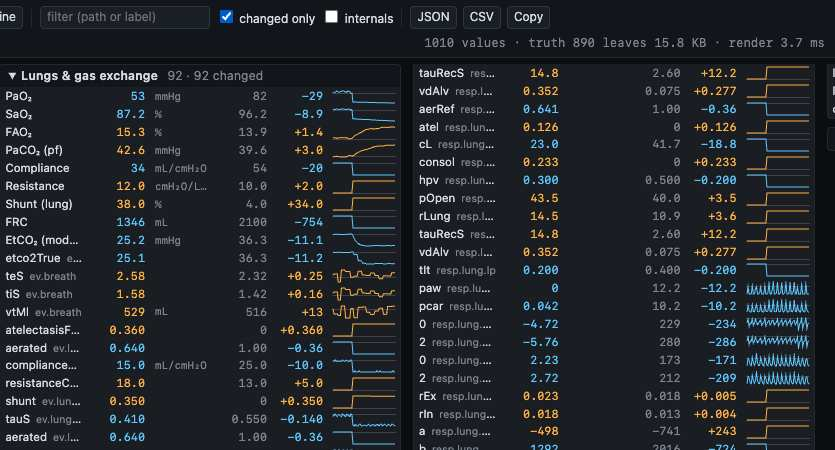
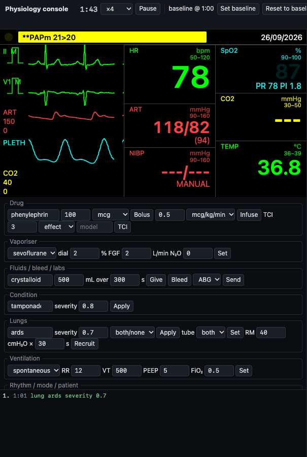
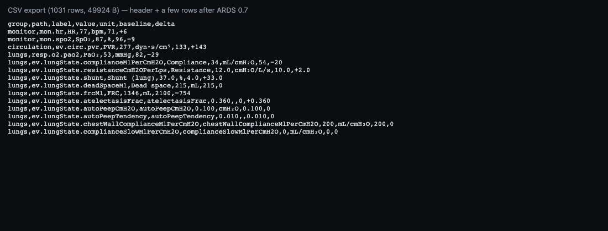

# Stage 7x gate — physiology developer console

**Gate question.** Does `apps/demo/physiology-console.html` show the live monitor beside every physiologic truth value,
grouped by organ, each with value, baseline, delta and a 60 s sparkline, with an actions rail that sends the instructor
panel's commands, a change log, reset to baseline and JSON/CSV export (R52) — through ONE additive, read-only engine
accessor that stays inside its budget?

**Answer.** Yes. The page runs the real monitor (worker, `worker-raf` in Chrome) with `truthHz: 1`; the truth tree
crosses the worker inside the ordinary event batches (≈ 15 KB, well under 50 KB). Phenylephrine from the rail makes one
accepted log entry and moves SVR +523 dyn·s/cm⁵ against the 60 s baseline; a 7b lung condition, which merged while
this stage ran, appears in the Lungs section without any page edit. Every suite is green. Branch
`stage-7x-physiology-console`; plan `docs/plans/stage-7x-physiology-console.md` (ticked).

## 1. What shipped

- **Page** `apps/demo/physiology-console.html` (`?skin=`, `?seed=`, `?preset=`, `?mode=manual`), linked from `index.html`
  and built by `apps/demo/vite.config.ts` (one additive line each).
- **Accessor** (the one additive engine change): `EngineOptions.truthHz` (0 = off by default, ≤ 2 Hz, `RangeError`
  outside) → event `{ type: 'truth', t, tree, leaves, dropped, truncated }` emitted after the tick's other events;
  `pruneTruth(st, dev)` and `TRUTH_LIMITS` exported. Lines marked `// Stage 7x` in `types.ts` (import, option, union
  member), `index.ts` (2 exports) and `engine.ts` (import, field, 3 constructor lines, 1 emit line).
- **Files**

| File | Responsibility |
|---|---|
| `packages/engine-core/src/types-truth.ts` | `TruthLeaf`, `TruthTree`, `TruthEvent` |
| `packages/engine-core/src/truth.ts` | `pruneTruth`, `TRUTH_LIMITS` (read-only prune) |
| `packages/engine-core/test/truth.test.ts`, `test/engine/truth-event.test.ts` | prune rules; rate, budget, cost, read-only |
| `apps/demo/src/physiology-console/flatten.ts` | tree + events → dotted paths (`ev.<type>.*`, `mon.<id>`) |
| `apps/demo/src/physiology-console/organs.ts` | 14 groups, `GROUP_BY_PREFIX`, internals, phase rows |
| `apps/demo/src/physiology-console/meta.ts`, `format.ts` | labels, units, digits, scale; change tolerances |
| `apps/demo/src/physiology-console/sparkline.ts` | 60-sample history, canvas plot |
| `apps/demo/src/physiology-console/model.ts` | current / baseline / delta / history; JSON and CSV |
| `apps/demo/src/physiology-console/actions.ts` | rail command builders, presets |
| `apps/demo/src/physiology-console/view.ts` | `mountConsole` (header, rail, log, organ sections) |
| `apps/demo/src/physiology-console/main.ts` | page entry: `mountMonitor` + `ConsoleHost` + `window.__pmeConsole` |
| `apps/demo/src/physiology-console/*.test.ts`, `view.dom.test.ts` | unit tests; happy-dom page test (real engine) |
| `apps/demo/e2e/physiology-console.e2e.ts` | Playwright: load, phenylephrine, SVR delta, log, screenshots |

## 2. Accessor budget

| Quantity | 7a-only main (Task 1) | after 7b merged (gate) |
|---|---|---|
| Truth tree, adult MODELED at 10 s (engine test) | 744 leaves, 22 dropped, 12 970 B JSON, not truncated | 898 leaves, 22 dropped, 15 527 B, not truncated |
| `pruneTruth` per call (warm, 200 calls; budget 0.2 ms, CI asserts < 1 ms) | 0.125 ms | 0.104 ms alone; 0.372 ms inside the full parallel suite |
| Future tree: + six 150-leaf organ sub-trees + realistic 7g `pk`, 12 drugs | 1 891 leaves, 43 014 B, not truncated | 2 036 leaves, 45 355 B, not truncated |
| Busy tree: the same with all 58 library drugs | 2 100 leaves (cut), 48 658 B, devices whole | 2 100 leaves (cut), 48 522 B, devices whole |
| Live page, Chrome, `worker-raf`, ×4, sim 61 s (e2e) | — | 847 leaves, 14 868 B (header: 886 leaves, 15.4 KB) |
| Rows on the page (default view, internals hidden) | — | 1 002–1 010 values; render 3.1–5.0 ms per refresh |

- **Read-only proof:** the twin-engine test (same seed, one engine at `truthHz: 2`, one without) gives the identical
  `snapshot().state` JSON and the identical last 500 ABP samples after 20 s; the prune test asserts the input is
  unchanged (`structuredClone` before/after). Truth events arrive at t = 1, 2, …, 10 exactly at `truthHz: 1`.
- **Headroom (for the orchestrator):** 7b added 154 leaves / 2.5 KB to today's tree. The typical-future case
  (12 drugs) now sits at 2 036 of 2 100 leaves: when 7c/7d/7e land with real trees, it may be cut. Per D2 the owning
  stage adds its machinery keys to `truth.ts`'s SKIP lists; the cap was NOT raised.

## 3. Acceptance

**Phenylephrine 100 µg iv from the rail** (adult, seed default, ×4; auto-baseline at 1:00; e2e):

| Row | Baseline (1:00) | +40 s | Delta |
|---|---|---|---|
| SVR (`ev.circ.svr`) | 1 218 dyn·s/cm⁵ | 1 741 | **+523** (amber, row class `up`) |
| ABP sys / dia / mean | 123 / 81 / 96 mmHg | 143 / 99 / 117 | +21 / +18 / +22 |
| HR (monitor) | 71 /min | 61 | −10 (cyan) |
| CO | 5.37 L/min | 5.43 | +0.07 (not highlighted: < 2 %) |
| PVR / LVEDP | 133 / 9.8 | 145 / 15.9 | +12 / +6.0 |

Change log: one accepted (green) line `1:02 phenylephrine 100 mcg iv`. Monitor output 10 of 14 rows changed,
circulation 26 of 119. No page errors.

**Lung condition from the rail — 7b's `lungCondition` (ARDS, severity 0.7, both lungs)**, +40 s (scratch script, see
Deviations): log `1:01 lung ards severity 0.7` accepted; SpO₂ 96 → 88 %, PaO₂ 82 → 53 mmHg, shunt 4 → 38 %, EtCO₂
(model) 36.3 → 25.2 mmHg, lung compliance 54 → 34 mL/cmH₂O, FRC 2 100 → 1 346 mL, PVR 133 → 276 dyn·s/cm⁵, HR 71 → 77.
The Lungs section holds 238 rows (7b's `resp.lung.*` and `ev.lungState.*` included, no page edit); 92 changed.

**Export:** JSON 173 859 B (`schema, t, baselineT, values`), CSV 1 031 rows / 49 924 B
(`group,path,label,value,unit,baseline,delta`).

**Test counts** (after merging main with 7b; `CI=1 pnpm -r test`):

| Package | Result |
|---|---|
| typecheck (`pnpm -r typecheck`) | 8/8 packages clean |
| engine-core | 166 files, **709 passed / 1 skipped** (7x: +11 — prune 7, event 4); 596 / 1 on 7a-only main at Task 1 |
| demo | 7 files, **114 / 114** (flatten 5, organs 39, format 45, sparkline 4, model 7, actions 4, view 10) |
| audio / skins / validation / ventilator / controller / renderer | 58 / 168 / 16 (+5 skipped) / 88 / 196 / 65, all pass |
| build (`pnpm -r build`) | all Done; `dist/physiology-console.html` 4.99 kB, `physiology-console-*.js` 29.40 kB (11.19 kB gzip) |
| check-notices | `OK (3 governed files)` |
| e2e (`PW_SYSTEM_CHROME=1 pnpm test:e2e`) | **25 / 25** passed (2.4 min); the 7x test 26.5–28.1 s |

## 4. Screenshots (JPEG quality 55, each ≤ 60 KB)

The console at rest (baseline just captured at 1:00): the monitor, the rail and an empty log.

The organ sections at rest: Monitor output and Circulation first, every delta 0 or jitter.

Phenylephrine +40 s: SVR 1 741 against 1 218 in amber with a rising sparkline; MAP up, HR down in cyan.

Phenylephrine +40 s, left: the monitor's ART 143/99 (117), HR 61, and the green log line.

"Changed only": the sections shrink to the rows that moved beyond their tolerance.

ARDS 0.7 +40 s, changed only, Lungs section at the top: PaO₂, SaO₂, shunt, compliance, FRC, EtCO₂ and 7b's per-lung
fields.

ARDS 0.7 +40 s, left: SpO₂ falling on the monitor, the accepted `lung ards severity 0.7` log line.

The CSV export (header and a few rows, rendered for the note).

The other clips (`*-organs-bottom.jpg`, `phenylephrine-changed-only-left.jpg`) are in `docs/gates/stage-7x/`.

## 5. Decisions and deviations

**Decisions** (plan D1–D12, as executed):
- D1 opt-in `truth` EVENT (`truthHz`, ≤ 2 Hz), no getter, no `snapshot()`, no renderer change.
- D2 `pruneTruth` builds a new object; NaN/±Infinity as strings; skips ECG machinery, `out`/`rng`, the alarm profile and
  7a's reference copies; devices walked first; 2 100-leaf cap; ≤ 50 KB contract.
- D3 the page runs the real monitor (`mountMonitor`, worker when available), no shadow engine.
- D4 one flat model of dotted paths; events folded generically under `ev.<type>.`, replaced per type; `mon.<id>`.
- D5 14 organ groups, longest whole-segment prefix, unknown → "other"; 7b–7g prefixes included.
- D6 bookkeeping and machinery flagged "internals" (hidden by default, never dropped).
- D7 curated labels/units/digits/scale for ≈ 50 paths; field-name suffix and sibling `unit` defaults.
- D8 auto-baseline at the first truth event with sim ≥ 60 s; set/reset via engine snapshot/restore with clock re-sync.
- D9 change = |Δ| ≥ max(2 % or absolute tolerance, one displayed digit); within-beat/breath rows never highlight.
- D10 rail builders send the instructor panel's command bodies; unknown ids still sent, rejection shown in the log.
- D11 `ConsoleHost` seam; happy-dom test with a real main-thread engine.
- D12 three JPEG clips per state, ≤ 60 KB each; skipped in WebKit.

**Deviations:**
1. **Main moved twice.** Task 8 merged `origin/main` with 7b (PR #14) before the page-list edits: one conflict, the
   adjacent import lines in `packages/engine-core/src/types.ts` — both kept (7b's `types-lung` import, 7x's
   `types-truth` import). Task 9 merged again (RESUME only). typecheck and the 7x tests were re-run after each merge.
   7g (PR #15) had NOT merged by the gate: its `infusion`/`tci`/`vaporiser` commands are still sent by the rail and,
   until it lands, the engine's rejection reason shows in the change log (D10; not exercised in the e2e); nothing was
   stubbed. Its fields will appear by themselves when it lands.
2. **Extra evidence outside the committed e2e.** The plan's e2e covers rest and phenylephrine; the lung-condition and
   export screenshots/numbers came from a scratch Playwright script (same Vite server and page, not committed). The
   committed test code is byte-identical to the plan.
3. **Order of work:** while another executor's full engine-core run occupied the machine, the red→green steps of
   Tasks 2–7 were run before Task 1's full-suite check finished; the commits are still one per task, in order, each
   pushed.
4. **Numbers moved with 7b** (not a 7x change): tree 744 → 898 leaves, 12.9 → 15.5 KB; typical-future tree 1 891 →
   2 036 leaves (headroom note in §2). `pruneTruth` measured 0.372 ms inside the fully parallel suite (budget 0.2 ms
   measured alone: 0.104 ms; the CI assertion is < 1 ms).
5. PR title shortened to "Stage 7x: physiology developer console" (orchestrator's brief).

**Observation (not 7x):** the monitor's CO₂ numeric reads `---` on this page at rest (the modelled EtCO₂ is 36 mmHg in
the truth tree); the same happens in the prototype on 7a-only main, so it predates this stage — worth a look by the
owner of the capnography path.

## 6. For Ali

Open `physiology-console.html` (demo dev server or `dist/`). Try: pick a preset under "Rhythm / mode / patient" and
Restart; wait for "baseline @ 1:00"; give phenylephrine (the Drug row's defaults) or apply a lung condition; watch the
amber (up) / cyan (down) rows and sparklines; tick "changed only"; export CSV for calibration notes; "Reset to
baseline" rewinds the engine to the captured moment. `?skin=zoll-like` etc. switches the monitor skin.

Open questions (plan "Requests"):
1. Brief §7.3: record `truth` as a public event, or keep it a documented dev-tool event (opt-in only)?
2. Sibling stages' machinery: add their internals to `INTERNAL_PREFIXES` and, if the tree nears 50 KB / 2 100 leaves,
   their machinery keys to `truth.ts`'s SKIP lists (7b already took 154 leaves of headroom) — a 7x.1 follow-up after
   Wave C, or each stage in its gate task?
3. Base excess and HCO₃ use the 2 % default tolerance; add rows to `TOLERANCES` in `meta.ts` during calibration?
4. Auto-baseline at sim 60 s (`autoBaselineS`): keep, or 30 s / "on first command"?
5. ECMO has no owning stage; its paths will land in "other" until mapped.
6. happy-dom resolves through Vitest's peer link; an explicit `devDependencies` entry would be a separate lockfile PR.
